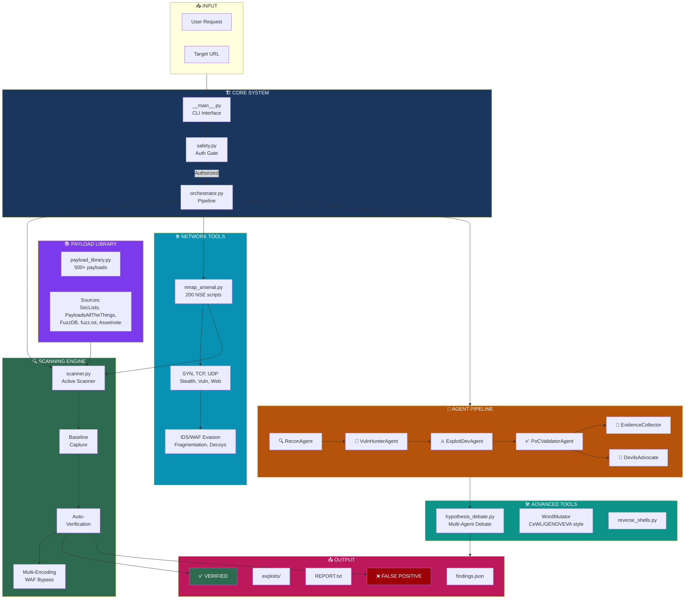
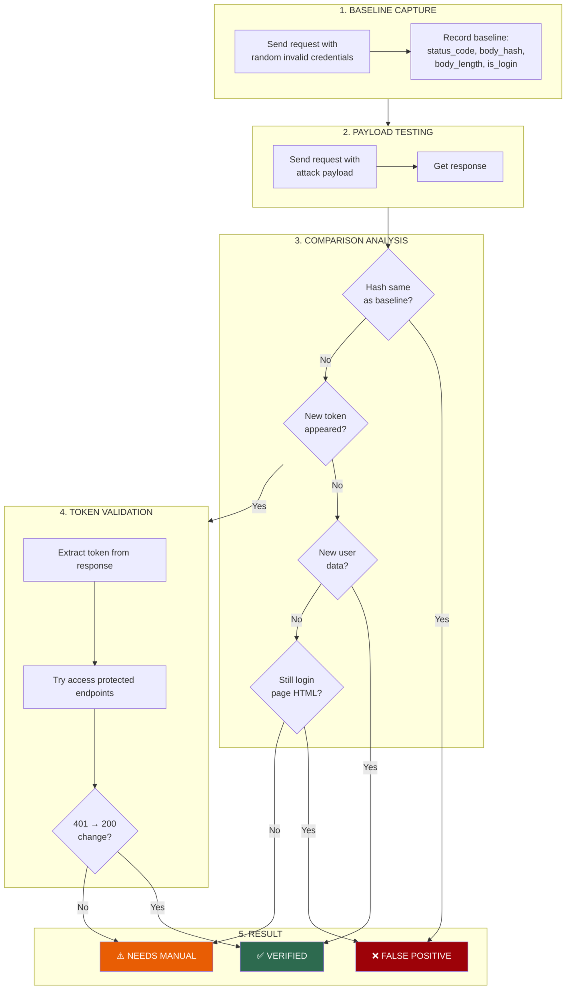
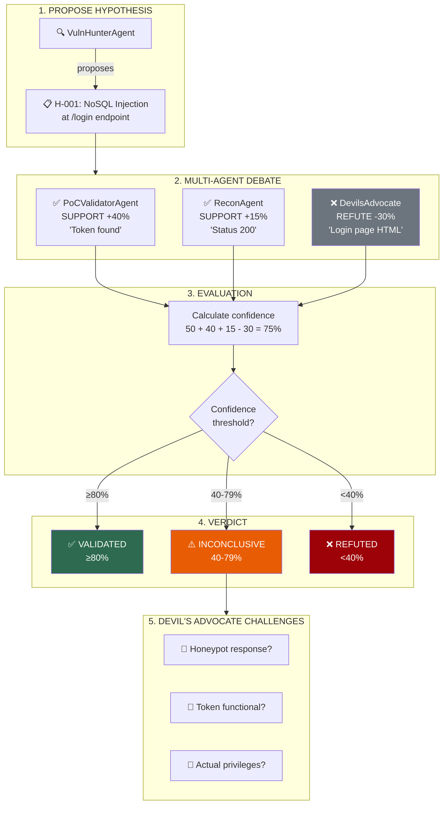
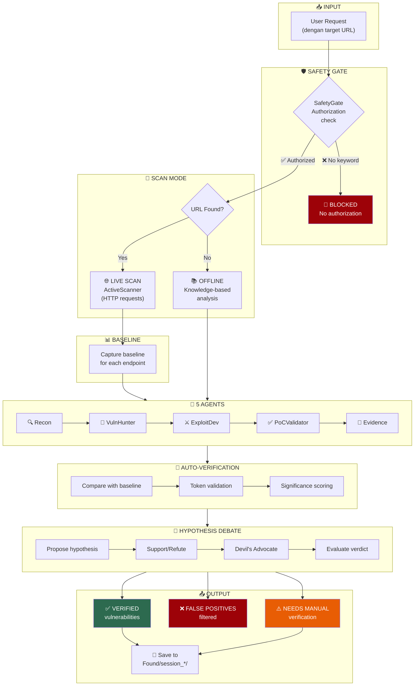

# Attack Surface - Zero-Day Research Framework

Framework multi-agent untuk zero-day security research dengan **live active scanning**, **hypothesis debate system**, dan **auto-verification**. Menghasilkan **validated payload**, **exploit code**, dan **PoC** dengan eliminasi false positive otomatis.

## Features

### Core Scanning
- 🌐 **Live Active Scanning** - Real HTTP requests ke target untuk deteksi vulnerability
- 🔍 **Automated Reconnaissance** - Identifikasi endpoint, parameter, stack teknologi
- 🎯 **Vulnerability Discovery** - 25+ attack categories dengan 500+ payload variants

### Auto-Verification System
- ✅ **Baseline Comparison** - Capture response dengan invalid creds, bandingkan dengan payload response
- 🔑 **Token Validation** - Extract token dan validasi dengan akses protected resource
- 🛡️ **False Positive Filtering** - Otomatis filter "200 response yang sebenarnya login page"
- 📊 **Significance Scoring** - Hitung perubahan response (token baru, user data, length diff)

### Hypothesis Debate System
- 🧪 **Multi-Agent Debate** - 6 agent roles mendebat setiap vulnerability
- 💬 **Support/Refute Mechanism** - Setiap agent memberikan evidence pro/kontra
- 👿 **Devil's Advocate** - Agent khusus yang menantang setiap hipotesis
- 📈 **Confidence Scoring** - Kalkulasi confidence berdasarkan debate outcome

### NEW: Expanded Payload Library (v0.5.0)
Sources terintegrasi dari komunitas security:
- 📚 **[PayloadsAllTheThings](https://github.com/swisskyrepo/PayloadsAllTheThings)** - 80k+ stars, comprehensive web attack payloads
- 📚 **[SecLists](https://github.com/danielmiessler/SecLists)** - 73k+ stars, security tester's companion
- 📚 **[FuzzDB](https://github.com/fuzzdb-project/fuzzdb)** - Attack patterns database
- 📚 **[fuzz.txt](https://github.com/Bo0oM/fuzz.txt)** - Dangerous files wordlist
- 📚 **[Assetnote](https://wordlists.assetnote.io/)** - Auto-updated monthly wordlists
- 🔧 **[CeWL](https://github.com/digininja/CeWL)** - Custom wordlist from target (technique)
- 🔧 **[GENOVEVA](https://github.com/joseaguardia/GENOVEVA)** - 17M+ mutations per word
- 🔧 **[s0md3v/wl](https://github.com/s0md3v/wl)** - Case style conversion

### Attack Categories (25+)
| Category | Payloads | Description |
|----------|----------|-------------|
| SQL Injection | 40+ | MySQL, PostgreSQL, MSSQL, Oracle, SQLite |
| NoSQL Injection | 25+ | MongoDB operators, CouchDB, timing attacks |
| XSS | 35+ | Reflected, DOM, filter bypass, polyglot |
| SSRF | 30+ | Cloud metadata, protocol smuggling, DNS rebinding |
| SSTI | 25+ | Jinja2, Twig, Freemarker, Velocity, ERB, Mako |
| XXE | 15+ | File read, SSRF via XXE, blind OOB, XInclude |
| LFI/Path Traversal | 30+ | PHP wrappers, log poisoning, filter bypass |
| RCE/Command Injection | 25+ | Separators, blind, filter bypass, exfil |
| JWT | 20+ | alg:none, RS256→HS256, claim manipulation |
| CRLF Injection | 10+ | Header injection, HTTP response splitting |
| Open Redirect | 15+ | Protocol relative, parser confusion, unicode |
| LDAP Injection | 10+ | Wildcard, filter bypass, enumeration |
| XPath Injection | 10+ | Blind extraction, node enumeration |
| GraphQL | 10+ | Introspection, batching, nested DoS |
| Prototype Pollution | 10+ | __proto__, constructor, EJS RCE |
| Deserialization | 10+ | PHP, Python, Java, Ruby, .NET patterns |
| Type Juggling | 10+ | PHP loose comparison, magic hashes |
| Mass Assignment | 15+ | Admin, role, permission parameters |
| File Upload | 25+ | Extension bypass, double ext, null byte |
| CORS | 10+ | Origin bypass, null origin |
| Request Smuggling | 10+ | CL.TE, TE.CL, obfuscation |
| Directory Discovery | 60+ | Admin, config, backup, API, cloud |
| Prompt Injection | 10+ | AI/LLM jailbreak patterns |
| Web Cache | 5+ | Cache poisoning, deception |
| IDOR | 10+ | ID manipulation, UUID guessing |

### Exploit Development
- ⚔️ **Dynamic Payload Generation** - Generate payload dengan 10+ encoding variants
- 🐚 **Reverse Shell Support** - Bash, Python, PHP, Perl, Ruby, Netcat, PowerShell
- 🔄 **Word Mutation** - Leet speak, case variations, suffix combinations (GENOVEVA-style)
- 📁 **Evidence Collection** - Simpan findings terstruktur dengan hash verification

## Architecture Overview



## Struktur

```text
src/attack_surface/
  scanner.py       # Active scanner dengan auto-verification & baseline comparison
  agents.py        # 5 agent: Recon, VulnHunter, ExploitDev, PoCValidator, EvidenceCollector
  models.py        # Data models + LiveScannerModel untuk real scan results
  orchestrator.py  # Pipeline dengan hypothesis debate integration
  safety.py        # Authorization gate (izin tertulis, bug bounty, pentest contract)
  __main__.py      # CLI dengan auto-save findings

tools/                         # Advanced tools
  payload_library.py           # 500+ payloads dari SecLists, PayloadsAllTheThings, dll
  payload_generator.py         # Dynamic payload generation dengan encoding
  hypothesis_debate.py         # Multi-agent debate system
  enhanced_scanner.py          # Scanner dengan full debate integration
  reverse_shells.py            # Reverse shell payload generator
  nmap_arsenal.py              # NEW: 200 NSE scripts, preset scans, evasion techniques

tests/
  test_orchestrator.py
  test_safety.py

Found/               # Output directory untuk findings
  session_YYYYMMDD_HHMMSS/
    REPORT.txt
    findings.json
    payloads.txt
    summary.json
    exploits/
```

## Quick Start

### Live Scan (Real Target)
```powershell
$env:PYTHONPATH = "src"
python -m attack_surface "Zero-day research https://target.example.com dengan izin tertulis"
```

### Install & Run
```powershell
python -m pip install -e .
attack-surface "Zero-day research https://api.target.com dengan bug bounty authorization"
```

## Usage

### Basic Scan
```powershell
# Scan target dengan otorisasi bug bounty
python -m attack_surface "Zero-day research https://target.com dengan bug bounty"

# Scan API endpoint spesifik
python -m attack_surface "Test https://api.target.com/v1 security dengan izin tertulis"
```

### With Hypothesis Debate (Recommended)
```powershell
# Enable debate untuk validation yang lebih akurat
python -m attack_surface "Security research https://target.com dengan izin tertulis" --debate
```

### Verbose Mode (Debug)
```powershell
# Lihat semua verification details
python -m attack_surface "Test https://target.com dengan authorized pentest" --verbose
```

### Offline Mode (tanpa target URL)
```powershell
# Analisis berbasis knowledge tanpa live scan
python -m attack_surface "Analisis vulnerability endpoint login dengan izin tertulis"
```

### CLI Options
| Option | Description |
|--------|-------------|
| `--debate` | Enable multi-agent hypothesis debate system |
| `--verbose` | Show detailed verification output |
| `--no-save` | Don't save findings to disk |
| `--output DIR` | Custom output directory |

### Authorization Keywords
Request harus mengandung salah satu keyword otorisasi:
- `izin tertulis`
- `dengan izin`
- `bug bounty`
- `pentest contract`
- `authorized`
- `security research`

## Live Scanner

Scanner melakukan HTTP-based testing dengan **auto-verification**:

| Test Type | Description | Payloads | Verification |
|-----------|-------------|----------|--------------|
| **NoSQL Injection** | MongoDB operator injection | `$gt`, `$ne`, `$exists`, `$regex`, `$where` | Baseline + Token validation |
| **SQL Injection** | Classic SQLi detection | `' OR '1'='1`, `UNION SELECT`, time-based | Error-based + Time-based |
| **JWT Vulnerabilities** | Algorithm confusion | `alg:none`, weak secret detection | Protected resource access |
| **Auth Bypass** | Authentication weaknesses | Default creds, type juggling, empty auth | Token extraction + validation |
| **XSS** | Cross-site scripting | Reflected XSS in parameters | Payload reflection check |
| **SSRF** | Server-side request forgery | Internal IP probing, localhost access | Metadata response check |
| **LFI** | Local file inclusion | Path traversal, wrapper protocols | File content indicators |
| **RCE** | Remote code execution | Command injection, sleep-based | Time-based detection |

### Auto-Verification Process



**Significance Scoring:**
| Condition | Score |
|-----------|-------|
| Status changed to 200 | +30 |
| New token appeared | +40 |
| New user data | +30 |
| Bypassed login page | +25 |
| Length diff >50% | +15 |

### Hypothesis Debate System

Setiap vulnerability melalui proses debate multi-agent:



### Agent Roles

| Agent | Role | Evidence Type |
|-------|------|---------------|
| **ReconAgent** | Reconnaissance & endpoint discovery | HTTP headers, status codes |
| **VulnHunterAgent** | Propose vulnerabilities | Payload responses |
| **ExploitDevAgent** | Develop working exploits | Successful exploitation |
| **PoCValidatorAgent** | Validate PoC | Token validation, data access |
| **DevilsAdvocateAgent** | Challenge all hypotheses | False positive indicators |
| **EvidenceCollectorAgent** | Collect and hash evidence | Response hashes |

### Tech Stack Detection
Scanner otomatis mendeteksi:
- Server (nginx, Apache, IIS, etc.)
- Frameworks (Express, Django, Flask, Laravel, etc.)
- Languages (Python, Node.js, PHP, Java, etc.)
- Auth mechanisms (JWT, OAuth, session-based)

### Endpoint Discovery
Scanner mencari endpoints umum:
- `/api/v1/login`, `/api/v1/users`, `/api/v1/admin`
- `/auth/login`, `/auth/token`, `/auth/refresh`
- `/graphql`, `/api/graphql`
- `/admin`, `/dashboard`, `/profile`

## Pipeline



## Output Format

### findings.json (Live Scan Result)
```json
{
  "id": "VULN-001",
  "title": "NoSQL Injection Authentication Bypass",
  "severity": "critical",
  "target": "https://target.example.com",
  "endpoint": "/api/v1/login",
  "validation_status": "validated",
  "evidence": {
    "request": "POST /api/v1/login",
    "payload": "{\"username\": {\"$gt\": \"\"}, \"password\": {\"$gt\": \"\"}}",
    "response_code": 200,
    "indicators": ["token", "jwt", "access_token"]
  },
  "poc": {
    "steps": ["1. POST to /api/v1/login", "2. Use NoSQL payload", "3. Extract token"],
    "verified": true,
    "evidence_hash": "sha256:..."
  }
}
```

### Generated Exploits
Exploit scripts di-generate dengan **target URL sebenarnya**:

- `exploits/nosql_injection.py` - NoSQL injection dengan target URL
- `exploits/jwt_bypass.py` - JWT algorithm confusion exploit
- `exploits/attack_chain.sh` - Combined attack chain dengan semua phases

## Sample Output

### Auto-Verification in Action
```
[*] Starting active scan on: https://target.example.com
[*] Phase 1: Reconnaissance...
[*] Hypothesis Debate System: ENABLED
[*] Phase 2a: Capturing baselines for verification...
[*] Testing endpoint: https://target.example.com/login (POST)
    [Baseline] Capturing baseline for https://target.example.com/login
    [Baseline] Status: 200, Length: 5955, IsLoginPage: True
    [-] FALSE POSITIVE: Response identical to baseline
    [-] FALSE POSITIVE: Response identical to baseline
    [-] FALSE POSITIVE: Still login page HTML

[*] Auto-Verification Summary:
    [+] VERIFIED vulnerabilities: 0
    [?] Needs manual verification: 0
    [-] FALSE POSITIVES filtered: 18

[*] Filtered False Positives:
    NoSQL Injection: 7 payloads filtered
    Authentication Bypass: 11 payloads filtered
```

### Hypothesis Debate Output
```
======================================================================
[NEW HYPOTHESIS] [H-001]
======================================================================
  Proposed by: VulnHunterAgent
  Title: NoSQL Injection
  Description: Potential NoSQL Injection at https://target.com/login
  Initial Evidence: http_response (confidence: 50%)

[+] SUPPORT for [H-001] NoSQL Injection
--------------------------------------------------
  Agent: PoCValidatorAgent
  Reasoning: Response contains sensitive_data indicators
  Evidence Type: content_analysis
  Confidence: 60%

[-] REFUTATION for [H-001] NoSQL Injection
--------------------------------------------------
  Agent: DevilsAdvocateAgent
  Counter-argument: Response appears to be login page - likely FALSE POSITIVE
  Evidence Type: false_positive_check
  Confidence: 75%

[!] DEVIL'S ADVOCATE CHALLENGES [H-001]
--------------------------------------------------
  1. Could this be a honeypot response?
  2. Is the 'token' in response actually functional?
  3. Does the response grant actual elevated privileges?

======================================================================
[?] HYPOTHESIS EVALUATION [H-001]
======================================================================
  Title: NoSQL Injection
  Verdict: INCONCLUSIVE
  Confidence: 59%
  Proposed by: VulnHunterAgent
  Supporters: VulnHunterAgent, PoCValidatorAgent
  Refuters: DevilsAdvocateAgent
  Evidence: 2 supporting, 1 refuting
```

### Debate Summary
```
======================================================================
=== DEBATE SUMMARY ===
======================================================================
  Total Hypotheses: 18
  [+] Validated: 2
  [~] Supported: 5
  [?] Inconclusive: 8
  [-] Refuted: 3
  Total Debate Messages: 54

  VALIDATED VULNERABILITIES:
    [H-003] SQL Injection (92%)
    [H-007] JWT Algorithm Confusion (88%)

  NEEDS MANUAL VERIFICATION:
    [H-001] NoSQL Injection (59%)
    [H-008] Authentication Bypass (63%)

  FALSE POSITIVES ELIMINATED:
    [H-002] NoSQL Injection
    [H-015] Auth Bypass
    [H-018] Auth Bypass
```

## Tests

```powershell
$env:PYTHONPATH = "src"
python -m pytest tests/ -v
```

## Requirements

- Python 3.10+
- `requests` library (untuk HTTP scanning)
- Target dengan otorisasi yang valid

## Disclaimer

⚠️ **For authorized security research only.**

Tool ini hanya boleh digunakan terhadap target dengan:
- Izin tertulis dari pemilik sistem
- Bug bounty program yang aktif
- Kontrak pentest yang valid
- Otorisasi resmi lainnya

Penggunaan tanpa otorisasi adalah ilegal dan tidak etis.

---

## Roadmap

```mermaid
flowchart LR
    subgraph DONE["✅ COMPLETED"]
        V1["v0.1.0<br/>Core Framework"]
        V2["v0.2.0<br/>Auto-Verification"]
        V3["v0.3.0<br/>Hypothesis Debate"]
        V4["v0.4.0<br/>Payload Generation"]
        V5["v0.5.0<br/>Payload Library<br/>25+ Categories, 500+ Payloads"]
        V1 --> V2 --> V3 --> V4 --> V5
    end

    subgraph PROGRESS["🚧 IN PROGRESS"]
        V6["v0.6.0<br/>WAF Bypass<br/>OOB Testing"]
    end

    subgraph PLANNED["📋 PLANNED"]
        V7["v0.7.0<br/>Chaining"]
        V8["v0.8.0<br/>Reporting"]
        V9["v0.9.0<br/>AI Enhancement"]
        V10["v1.0.0<br/>Production"]
        V7 --> V8 --> V9 --> V10
    end

    V5 --> V6 --> V7

    style V1 fill:#2d6a4f,color:#fff
    style V2 fill:#2d6a4f,color:#fff
    style V3 fill:#2d6a4f,color:#fff
    style V4 fill:#2d6a4f,color:#fff
    style V5 fill:#2d6a4f,color:#fff
    style V6 fill:#e85d04,color:#fff
    style V7 fill:#6c757d,color:#fff
    style V8 fill:#6c757d,color:#fff
    style V9 fill:#6c757d,color:#fff
    style V10 fill:#7c3aed,color:#fff
```



### ✅ v0.1.0 - Core Framework (Completed)
- [x] Multi-agent architecture (5 agents)
- [x] Safety gate dengan authorization keywords
- [x] Live HTTP scanning
- [x] Basic vulnerability detection (NoSQL, SQLi, JWT, XSS, SSRF)
- [x] Auto-save findings ke disk
- [x] Exploit code generation

### ✅ v0.2.0 - Auto-Verification (Completed)
- [x] Baseline comparison system
- [x] Token extraction & validation
- [x] False positive filtering
- [x] Significance scoring
- [x] Response hash comparison
- [x] Login page detection

### ✅ v0.3.0 - Hypothesis Debate (Completed)
- [x] Multi-agent debate system
- [x] 6 agent roles (termasuk Devil's Advocate)
- [x] Support/Refute mechanism
- [x] Confidence scoring berdasarkan debate
- [x] Debate summary & export

### ✅ v0.4.0 - Payload Generation (Completed)
- [x] Dynamic payload generator
- [x] Multiple encoding (URL, Base64, Hex, Unicode)
- [x] Payload mutation
- [x] Reverse shell generator (Bash, Python, PHP, etc.)
- [x] LFI & RCE payloads

### ✅ v0.5.0 - Expanded Payload Library (Completed)
- [x] Integrated PayloadsAllTheThings (80k+ stars)
- [x] Integrated SecLists wordlists/patterns (73k+ stars)
- [x] Integrated FuzzDB attack patterns
- [x] Integrated fuzz.txt dangerous files
- [x] 25+ attack categories (SQL, NoSQL, XSS, SSRF, SSTI, XXE, LFI, RCE, JWT, etc.)
- [x] 500+ individual payloads with metadata
- [x] 10+ encoding variants per payload (WAF bypass)
- [x] Risk level classification (low/medium/high/critical)
- [x] WordMutator: CeWL/GENOVEVA-style password mutations
- [x] TargetWordlistGenerator: Extract words from target HTML
- [x] Source attribution for each payload

### 🚧 v0.6.0 - WAF Bypass & OOB Testing (In Progress)
- [ ] Advanced WAF fingerprinting
- [ ] Rate limiting detection & evasion
- [ ] Blind injection detection
- [ ] Out-of-band (OOB) callback server
- [ ] DNS exfiltration verification
- [ ] HTTP callback verification

### 📋 v0.7.0 - Chaining & Automation (Planned)
- [ ] Vulnerability chaining (Auth Bypass → RCE)
- [ ] Automated attack chain execution
- [ ] Multi-step exploitation
- [ ] Session management & token refresh
- [ ] Parallel endpoint testing

### 📋 v0.8.0 - Reporting & Integration (Planned)
- [ ] HTML/PDF report generation
- [ ] CVSS scoring integration
- [ ] Nuclei template generation
- [ ] Burp Suite integration
- [ ] Export ke security platforms (HackerOne, Bugcrowd)

### 📋 v0.9.0 - AI Enhancement (Planned)
- [ ] LLM-powered payload mutation
- [ ] Intelligent fuzzing
- [ ] Pattern learning dari successful exploits
- [ ] Natural language vulnerability description
- [ ] Auto-suggest next attack vectors

### 📋 v1.0.0 - Production Ready (Future)
- [ ] Web UI dashboard
- [ ] API mode untuk integrasi
- [ ] Distributed scanning
- [ ] Vulnerability database integration
- [ ] Compliance checking (OWASP, PCI-DSS)

---

## Payload Library Usage

```python
from tools.payload_library import PayloadLibrary, PayloadCategory, WordMutator

# Initialize library
lib = PayloadLibrary()

# Get statistics
stats = lib.stats()
print(f"Total payloads: {stats['total']}")

# Get payloads by category
sqli = lib.get_by_category(PayloadCategory.SQL_INJECTION)
for payload in sqli[:5]:
    print(f"[{payload.risk_level}] {payload.description}")
    print(f"  Raw: {payload.raw[:50]}...")
    print(f"  URL encoded: {payload.encoded_variants['url'][:50]}...")

# Get critical payloads only
critical = lib.get_critical()

# Search payloads
ssrf = lib.search("metadata")
for p in ssrf:
    print(f"{p.category.name}: {p.raw}")

# Generate password mutations (CeWL/GENOVEVA style)
mutator = WordMutator()
mutations = mutator.generate_mutations("password", depth=1)
print(mutations[:10])  # ['Password', 'PASSWORD', 'p4ssword', 'p4ssword!', ...]
```

---

## Changelog

### v0.5.0 (Current)
- Added: Expanded Payload Library with 500+ payloads
- Added: 25+ attack categories from security research sources
- Added: PayloadsAllTheThings integration (SQLi, XSS, SSRF, SSTI, XXE, etc.)
- Added: SecLists patterns (discovery, fuzzing, passwords)
- Added: FuzzDB attack patterns
- Added: fuzz.txt dangerous files wordlist
- Added: Prompt Injection payloads for AI/LLM testing
- Added: Request Smuggling (CL.TE, TE.CL) payloads
- Added: Prototype Pollution payloads
- Added: WordMutator class (CeWL/GENOVEVA-style mutations)
- Added: TargetWordlistGenerator (extract words from HTML)
- Added: 10+ encoding variants per payload (WAF bypass)
- Added: Risk level classification (low/medium/high/critical)
- Added: Source attribution for each payload

### v0.4.0
- Added: Hypothesis Debate System dengan 6 agent roles
- Added: Auto-verification dengan baseline comparison
- Added: Token extraction dan validation
- Added: False positive filtering (18 FP → 0 dalam test)
- Added: Payload generator dengan encoding/mutation
- Added: Reverse shell generator
- Added: Verbose logging untuk debugging
- Fixed: Unicode encoding issues pada Windows
- Fixed: JWT false positive (login page detection)
- Fixed: WordPress detection (wp-json, wp-content)

### v0.3.0
- Added: SSL warning suppression
- Added: SSRF timeout handling
- Fixed: Evidence truncation (100→500 chars)

### v0.2.0
- Added: Live active scanning
- Added: Tech stack detection
- Added: Endpoint discovery
- Added: Auto-save findings

### v0.1.0
- Initial release
- Multi-agent architecture
- Safety gate system
- Basic CLI interface

---

## References

This framework integrates techniques and patterns from:

| Source | Description | Stars |
|--------|-------------|-------|
| [PayloadsAllTheThings](https://github.com/swisskyrepo/PayloadsAllTheThings) | Web application security payloads | 80k+ |
| [SecLists](https://github.com/danielmiessler/SecLists) | Security tester's companion | 73k+ |
| [FuzzDB](https://github.com/fuzzdb-project/fuzzdb) | Attack patterns database | 8k+ |
| [fuzz.txt](https://github.com/Bo0oM/fuzz.txt) | Potentially dangerous files | 4k+ |
| [CeWL](https://github.com/digininja/CeWL) | Custom wordlist generator | 2k+ |
| [GENOVEVA](https://github.com/joseaguardia/GENOVEVA) | Password mutations (17M+) | 400+ |
| [Assetnote Wordlists](https://wordlists.assetnote.io/) | Monthly updated wordlists | - |

---

## License

MIT - For authorized security research only.
