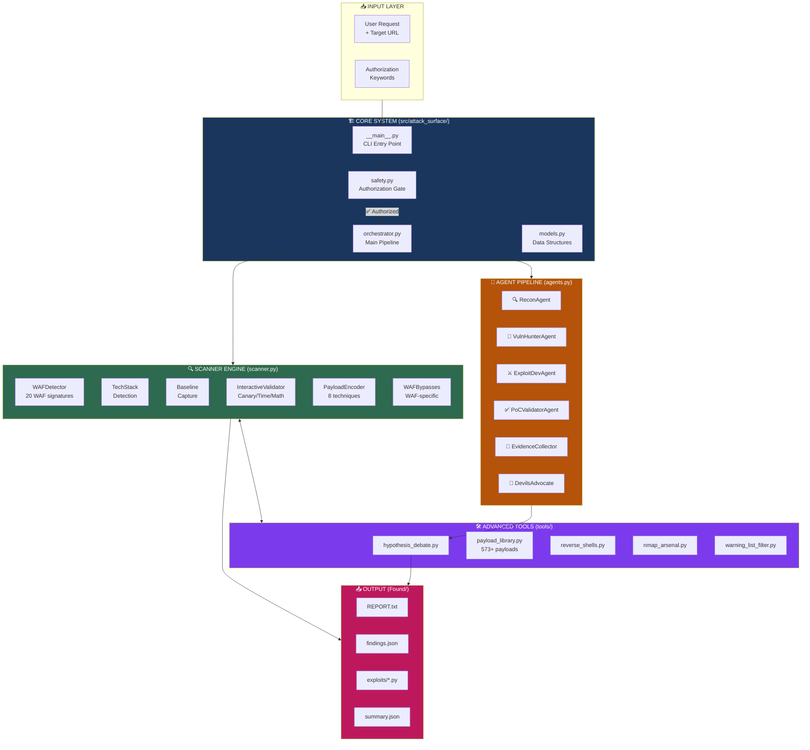
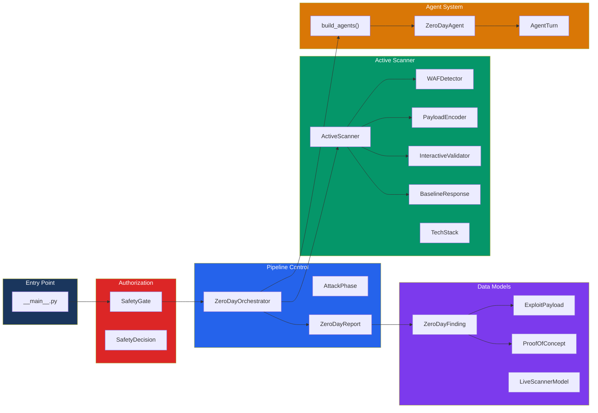
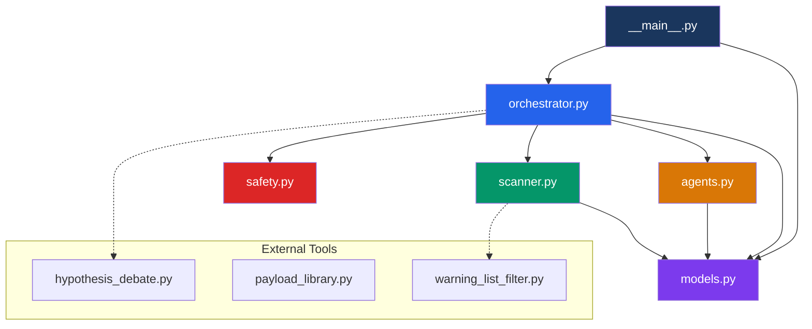
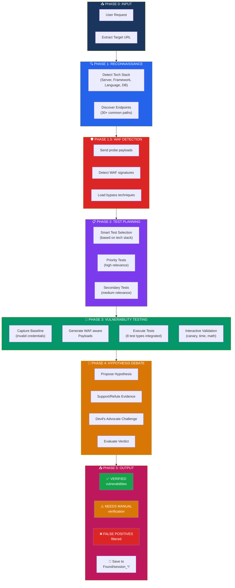
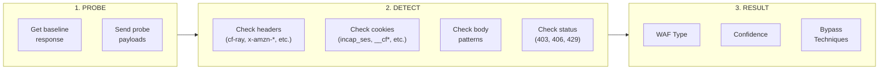
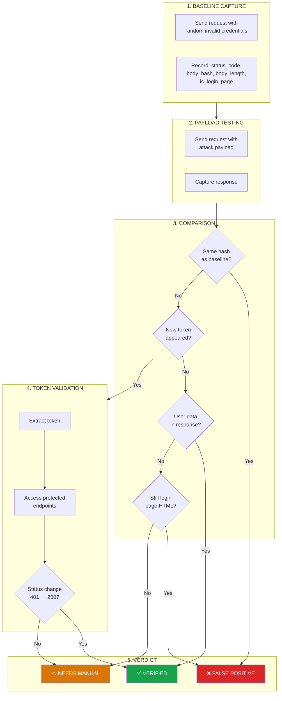
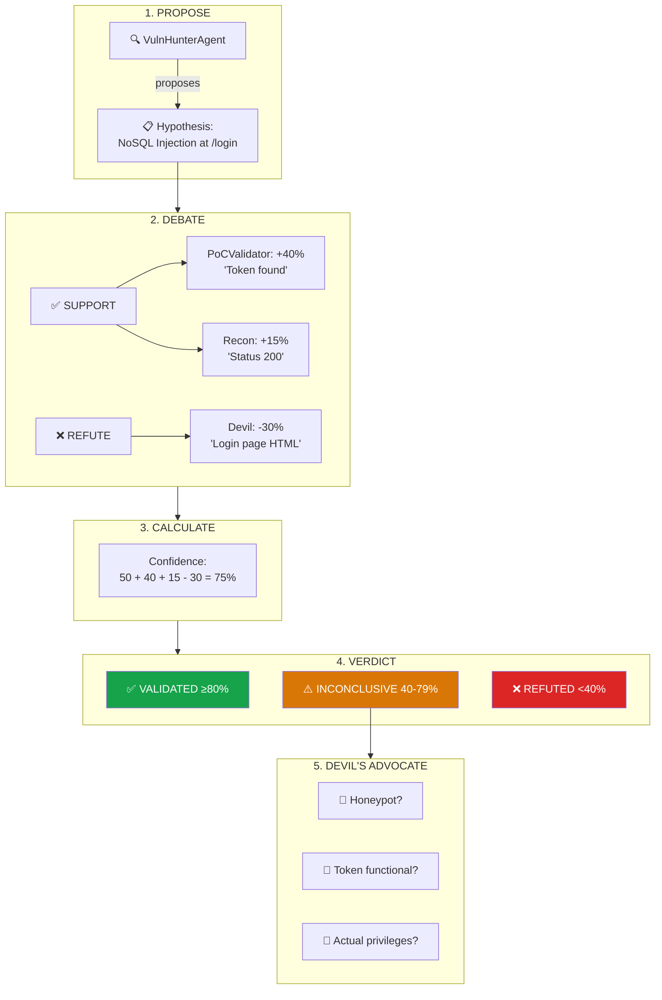

# Attack Surface - Zero-Day Research Framework

<div align="center">

[](https://www.python.org/)
[](#tests)
[](#changelog)
[](#disclaimer)

**🇮🇩 Framework multi-agent untuk zero-day security research dengan live active scanning, WAF bypass, hypothesis debate system, dan auto-verification.**

**🇬🇧 Multi-agent framework for zero-day security research with live active scanning, WAF bypass, hypothesis debate system, and auto-verification.**

[🇮🇩 Bahasa Indonesia](#-bahasa-indonesia) | [🇬🇧 English](#-english)

</div>

---

# 🇮🇩 Bahasa Indonesia

## 📖 Apa itu Attack Surface?

Attack Surface adalah framework keamanan otomatis yang menggunakan pendekatan **multi-agent** untuk menemukan kerentanan pada aplikasi web. Framework ini meniru cara kerja tim security researcher dengan berbagai peran yang saling berdebat dan memvalidasi temuan.

### Analogi Sederhana

Bayangkan Anda memiliki tim security yang terdiri dari:
- 🔍 **Scout** - Mencari informasi tentang target
- 🎯 **Hunter** - Mencoba berbagai serangan
- ⚔️ **Attacker** - Membuat exploit
- ✅ **Validator** - Memastikan temuan benar
- 👿 **Devil's Advocate** - Menantang setiap klaim

Framework ini otomatis melakukan semua itu!

## 🔄 Cara Kerja (Workflow)

```
┌──────────────────────────────────────────────────────────────┐
│                    ALUR KERJA ATTACK SURFACE                 │
└──────────────────────────────────────────────────────────────┘

1️⃣ INPUT
   User memasukkan: URL target + kata kunci otorisasi
   Contoh: "Zero-day research https://target.com dengan izin"

2️⃣ OTORISASI
   ├── ❓ Apa yang dicek? Kata kunci izin ("izin", "authorized", "pentest")
   ├── ⚙️ Bagaimana? SafetyGate memvalidasi intent user
   └── ✅ Hasil: IZINKAN / TOLAK

3️⃣ RECONNAISSANCE (Pengintaian)
   ├── ❓ Apa yang dideteksi?
   │   • Server: nginx, Apache, IIS
   │   • Framework: Laravel, Django, Express
   │   • Bahasa: PHP, Python, Node.js, Java
   │   • Database: MySQL, PostgreSQL, MongoDB
   ├── ⚙️ Bagaimana?
   │   • Analisis HTTP headers
   │   • Fingerprinting response body
   │   • Pattern cookie (PHPSESSID, connect.sid)
   └── ✅ Hasil: TechStack(server="nginx", framework="Laravel", ...)

4️⃣ DETEKSI WAF (Web Application Firewall)
   ├── ❓ Apa yang dideteksi?
   │   • Cloudflare, AWS WAF, ModSecurity, Imperva, dll
   ├── ⚙️ Bagaimana?
   │   • Kirim payload test: <script>alert(1)</script>
   │   • Cocokkan dengan 20 signature WAF
   └── ✅ Hasil: WAFResult(detected=True, name="Cloudflare", bypass=[...])

5️⃣ PENEMUAN ENDPOINT
   ├── ❓ Apa yang dicari?
   │   • Admin panel: /admin, /wp-admin
   │   • API: /api, /v1, /graphql
   │   • Config: /.env, /config.php
   ├── ⚙️ Bagaimana? Wordlist 54 path + crawling
   └── ✅ Hasil: Daftar endpoint dengan parameter

6️⃣ PENGUJIAN KERENTANAN
   ├── ❓ Apa yang diuji?
   │   • SQL Injection (50 payload)
   │   • XSS (38 payload)
   │   • SSRF, SSTI, LFI, RCE, XXE
   │   • Total: 37 kategori, 573+ payload
   ├── ⚙️ Bagaimana?
   │   • Kirim payload + encoding bypass WAF
   │   • Bandingkan response dengan baseline
   │   • Validasi dengan canary/time/math
   └── ✅ Hasil: Daftar kerentanan potensial

7️⃣ DEBATE (Perdebatan Agent)
   ├── ❓ Apa yang terjadi?
   │   • Setiap temuan didebat oleh 5 agent
   │   • Support vs Refute dengan bukti
   ├── ⚙️ Bagaimana?
   │   • Voting berdasarkan evidence
   │   • Devil's advocate menantang
   └── ✅ Hasil: Verdict (VERIFIED/NEEDS_MANUAL/FALSE_POSITIVE)

8️⃣ OUTPUT
   ├── 📄 REPORT.txt - Laporan ringkas
   ├── 📄 findings.json - Data terstruktur
   └── 📁 exploits/ - Kode exploit
```

## 📋 Fitur Utama

| Fitur | Deskripsi |
|-------|-----------|
| 🌐 **Live Scanning** | Request HTTP langsung ke target |
| 🔍 **Auto Recon** | Deteksi teknologi, endpoint, parameter |
| 🛡️ **WAF Bypass** | 20 WAF + 8 teknik encoding |
| 🧪 **Debate System** | 5 agent berdebat per temuan |
| ✅ **Auto Verifikasi** | Filter false positive otomatis |
| 📊 **Evidence** | Hash SHA256, timeline, CVSS |

## 🚀 Cara Menggunakan

```bash
# Install
pip install -e .

# Scan dengan izin
python -m attack_surface "Zero-day research https://target.com dengan izin tertulis"

# Mode verbose + debate
python -m attack_surface "Pentest https://target.com authorized" --verbose --debate

# Dengan API server
python -m attack_surface --api --port 8080
```

## 📁 Struktur File

```
src/attack_surface/
├── 🏗️ FONDASI (Infrastructure)
│   ├── config.py      # Semua konfigurasi di sini
│   ├── base.py        # Class dasar & enum
│   ├── utils.py       # Fungsi-fungsi bantu
│   └── exceptions.py  # Custom error handling
│
├── 🎯 CORE (Inti)
│   ├── orchestrator.py # Koordinator utama
│   ├── scanner.py      # Mesin scanning
│   ├── agents.py       # Definisi agent
│   └── safety.py       # Gerbang otorisasi
│
└── 📦 FITUR
    ├── oob_server.py   # Testing blind vulnerability
    ├── rate_limiter.py # Deteksi & bypass rate limit
    ├── chaining.py     # Chain vulnerability
    ├── reporter.py     # Generate laporan
    ├── ai_enhancer.py  # Mutasi payload cerdas
    └── api_server.py   # REST API & dashboard
```

---

# 🇬🇧 English

## 📖 What is Attack Surface?

Attack Surface is an automated security framework that uses a **multi-agent** approach to discover vulnerabilities in web applications. This framework mimics how a security research team works with various roles that debate and validate each finding.

### Simple Analogy

Imagine you have a security team consisting of:
- 🔍 **Scout** - Gathers information about the target
- 🎯 **Hunter** - Tries various attacks
- ⚔️ **Attacker** - Creates exploits
- ✅ **Validator** - Ensures findings are accurate
- 👿 **Devil's Advocate** - Challenges every claim

This framework automates all of that!

## 🔄 How It Works (Workflow)

```
┌──────────────────────────────────────────────────────────────┐
│                    ATTACK SURFACE WORKFLOW                   │
└──────────────────────────────────────────────────────────────┘

1️⃣ INPUT
   User provides: Target URL + authorization keyword
   Example: "Zero-day research https://target.com authorized"

2️⃣ AUTHORIZATION
   ├── ❓ What's checked? Authorization keywords ("authorized", "pentest")
   ├── ⚙️ How? SafetyGate validates user intent
   └── ✅ Result: ALLOW / REFUSE

3️⃣ RECONNAISSANCE
   ├── ❓ What's detected?
   │   • Server: nginx, Apache, IIS
   │   • Framework: Laravel, Django, Express
   │   • Language: PHP, Python, Node.js, Java
   │   • Database: MySQL, PostgreSQL, MongoDB
   ├── ⚙️ How?
   │   • HTTP headers analysis
   │   • Response body fingerprinting
   │   • Cookie patterns (PHPSESSID, connect.sid)
   └── ✅ Result: TechStack(server="nginx", framework="Laravel", ...)

4️⃣ WAF DETECTION (Web Application Firewall)
   ├── ❓ What's detected?
   │   • Cloudflare, AWS WAF, ModSecurity, Imperva, etc.
   ├── ⚙️ How?
   │   • Send test payload: <script>alert(1)</script>
   │   • Match against 20 WAF signatures
   └── ✅ Result: WAFResult(detected=True, name="Cloudflare", bypass=[...])

5️⃣ ENDPOINT DISCOVERY
   ├── ❓ What's searched?
   │   • Admin panels: /admin, /wp-admin
   │   • APIs: /api, /v1, /graphql
   │   • Config files: /.env, /config.php
   ├── ⚙️ How? 54 path wordlist + crawling
   └── ✅ Result: List of endpoints with parameters

6️⃣ VULNERABILITY TESTING
   ├── ❓ What's tested?
   │   • SQL Injection (50 payloads)
   │   • XSS (38 payloads)
   │   • SSRF, SSTI, LFI, RCE, XXE
   │   • Total: 37 categories, 573+ payloads
   ├── ⚙️ How?
   │   • Send payloads + WAF bypass encoding
   │   • Compare response with baseline
   │   • Validate with canary/time/math
   └── ✅ Result: List of potential vulnerabilities

7️⃣ DEBATE (Agent Discussion)
   ├── ❓ What happens?
   │   • Each finding debated by 5 agents
   │   • Support vs Refute with evidence
   ├── ⚙️ How?
   │   • Voting based on evidence
   │   • Devil's advocate challenges
   └── ✅ Result: Verdict (VERIFIED/NEEDS_MANUAL/FALSE_POSITIVE)

8️⃣ OUTPUT
   ├── 📄 REPORT.txt - Summary report
   ├── 📄 findings.json - Structured data
   └── 📁 exploits/ - Exploit code
```

## 📋 Core Features

| Feature | Description |
|---------|-------------|
| 🌐 **Live Scanning** | Direct HTTP requests to target |
| 🔍 **Auto Recon** | Detect technology, endpoints, parameters |
| 🛡️ **WAF Bypass** | 20 WAFs + 8 encoding techniques |
| 🧪 **Debate System** | 5 agents debate per finding |
| ✅ **Auto Verification** | Automatic false positive filtering |
| 📊 **Evidence** | SHA256 hash, timeline, CVSS |

## 🚀 How to Use

```bash
# Install
pip install -e .

# Scan with authorization
python -m attack_surface "Zero-day research https://target.com authorized"

# Verbose + debate mode
python -m attack_surface "Pentest https://target.com authorized" --verbose --debate

# With API server
python -m attack_surface --api --port 8080
```

## 📁 File Structure

```
src/attack_surface/
├── 🏗️ FOUNDATION (Infrastructure)
│   ├── config.py      # All configuration here
│   ├── base.py        # Base classes & enums
│   ├── utils.py       # Utility functions
│   └── exceptions.py  # Custom error handling
│
├── 🎯 CORE
│   ├── orchestrator.py # Main coordinator
│   ├── scanner.py      # Scanning engine
│   ├── agents.py       # Agent definitions
│   └── safety.py       # Authorization gate
│
└── 📦 FEATURES
    ├── oob_server.py   # Blind vulnerability testing
    ├── rate_limiter.py # Rate limit detection & bypass
    ├── chaining.py     # Vulnerability chaining
    ├── reporter.py     # Report generation
    ├── ai_enhancer.py  # Smart payload mutation
    └── api_server.py   # REST API & dashboard
```

---

## 📑 Table of Contents

- [Features](#features)
- [Architecture](#architecture)
- [Project Structure](#project-structure)
- [Installation](#installation)
- [Usage](#usage)
- [Scan Flow](#scan-flow)
- [Modules Detail](#modules-detail)
- [WAF Detection & Bypass](#waf-detection--bypass-v080)
- [Auto-Verification System](#auto-verification-system)
- [Hypothesis Debate System](#hypothesis-debate-system)
- [Output Format](#output-format)
- [Tests](#tests)
- [Changelog](#changelog)
- [Disclaimer](#disclaimer)

---

## Features

### Core Capabilities
| Feature | Description (EN) | Deskripsi (ID) |
|---------|-----------------|----------------|
| 🌐 **Live Active Scanning** | Real HTTP requests to target for vulnerability detection | Request HTTP nyata ke target untuk deteksi kerentanan |
| 🔍 **Automated Reconnaissance** | Identify endpoints, parameters, technology stack | Identifikasi endpoint, parameter, stack teknologi |
| 🛡️ **WAF Detection & Bypass** | 20 WAF signatures, 8 encoding techniques | 20 signature WAF, 8 teknik encoding |
| 🧪 **Hypothesis Debate** | 6 agent roles debate each vulnerability | 6 role agent mendebat setiap kerentanan |
| ✅ **Auto-Verification** | Baseline comparison, token validation, FP filtering | Perbandingan baseline, validasi token, filter FP |
| 🎯 **Smart Test Selection** | Test prioritization based on detected tech stack | Prioritas test berdasarkan tech stack terdeteksi |
| 📊 **Evidence Collection** | SHA256 hash verification, timeline, CVSS scoring | Verifikasi hash SHA256, timeline, skor CVSS |

### NEW: Smart Test Selection (v0.7.0)
Scanner otomatis memilih test berdasarkan detected tech stack / Scanner automatically selects tests based on detected tech stack:

| Stack Detected | Priority Tests |
|---------------|----------------|
| **PHP/Laravel/WordPress** | LFI, RCE, Type Juggling, Deserialization |
| **Python/Flask/Django** | SSTI (Jinja2), Deserialization |
| **Node.js/Express** | Prototype Pollution, NoSQL, SSTI |
| **Java/Tomcat/Struts** | Deserialization, XXE, SSTI, RCE |
| **.NET/ASP/IIS** | Deserialization, XXE, SQLi |
| **Ruby/Rails** | SSTI, Deserialization, Mass Assignment |
| **MongoDB detected** | NoSQL Injection (SQLi skipped) |
| **MySQL/PostgreSQL** | SQL Injection (NoSQL skipped) |
| **GraphQL endpoint** | Introspection, Batching DoS |
| **File upload found** | Extension bypass, Content-Type bypass |

**13 New Test Categories Added:**
- SSTI, LFI, XXE, RCE, CRLF, Open Redirect, CORS
- GraphQL, File Upload, Prototype Pollution
- Deserialization, Type Juggling, Mass Assignment

### Auto-Verification System
- ✅ **Baseline Comparison** - Capture response dengan invalid creds, bandingkan dengan payload response
- 🔑 **Token Validation** - Extract token dan validasi dengan akses protected resource
- 🛡️ **False Positive Filtering** - Otomatis filter "200 response yang sebenarnya login page"
- 📊 **Significance Scoring** - Hitung perubahan response (token baru, user data, length diff)

### NEW: MISP Warning List Integration (v0.6.0)
Filter false positive menggunakan [MISP Warning Lists](https://github.com/MISP/misp-warninglists):
- 🌐 **Top Domains** (132) - Google, Microsoft, Amazon, Apple, Meta, etc.
- ☁️ **Cloud Providers** (101 CIDRs) - AWS, Azure, GCP, DigitalOcean, Linode, Vultr
- 🚀 **CDN Ranges** (38 CIDRs) - Cloudflare, Akamai, Fastly
- 🔍 **Security Scanners** (26 CIDRs) - Shodan, Censys, Rapid7, Shadowserver
- 🔒 **Public DNS** (46 IPs) - Google DNS, Cloudflare, Quad9, OpenDNS
- 🏠 **Private Networks** (16 CIDRs) - RFC1918, RFC5735, RFC6598
- 🔗 **Dynamic DNS** (37) - duckdns.org, no-ip.com, dynu.com
- 🔗 **URL Shorteners** (47) - bit.ly, goo.gl, t.co
- 📧 **Disposable Email** (35) - guerrillamail, mailinator, tempmail
- 🏛️ **Security Vendors** (44) - virustotal, kaspersky, crowdstrike
- 🔬 **Malware Analysis** (22) - any.run, hybrid-analysis, joesandbox
- 📱 **Link-in-Bio** (18) - linktr.ee, bio.link
- 🌐 **Captive Portals** (14) - connectivitycheck.gstatic.com, etc.

### Hypothesis Debate System
- 🧪 **Multi-Agent Debate** - 6 agent roles mendebat setiap vulnerability
- 💬 **Support/Refute Mechanism** - Setiap agent memberikan evidence pro/kontra
- 👿 **Devil's Advocate** - Agent khusus yang menantang setiap hipotesis
- 📈 **Confidence Scoring** - Kalkulasi confidence berdasarkan debate outcome

### NEW: WAF Detection & Bypass (v0.8.0)
Integrasi [waf-checker](https://github.com/SecH0us3/waf-checker) untuk deteksi dan bypass WAF:

**Supported WAFs (20):**
| WAF | Detection | Bypass |
|-----|-----------|--------|
| Cloudflare | cf-ray header, __cfduid cookie | Unicode, fullwidth chars, alternative quotes |
| AWS WAF | x-amzn-requestid, x-amz-cf-id | Character set variations, unicode normalization |
| ModSecurity | ModSecurity body patterns | Comment-based evasion, HPP |
| Imperva | incap_ses cookies | Prototype pollution bypass |
| Akamai | AkamaiGHost header | URL encoding, alternative separators |
| F5 BIG-IP | BigIP cookies, F5 header | Session manipulation |
| Sucuri | x-sucuri-id, sucuri-request | DNS bypass, cache poisoning |
| Wordfence | wordfence_verifiedHuman | Cookie manipulation |
| Azure Front Door | x-azure-ref header | Request routing bypass |
| Google Cloud Armor | x-cloud-trace-context | Alt encoding, case variation |
| + 10 more... | | |

**Encoding Techniques (8):**
- `double_url_encode()` - `'` → `%27` → `%2527`
- `unicode_encode()` - `'` → `\u0027`
- `html_entity_encode()` - `<` → `&#60;` / `&#x3c;`
- `mixed_case_encode()` - `SELECT` → `sElEcT`
- `hex_encode()` - SQL hex encoding `0x27`
- `comment_obfuscate()` - `SELECT *` → `SELECT/**/*/`
- `tab_obfuscate()` - Space → `%09`
- `sql_obfuscation()` / `xss_obfuscation()` - Attack-specific variations

**Scan Flow Integration:**
```
Phase 1: Reconnaissance
Phase 1.5: WAF Detection ← NEW
Phase 2: Vulnerability Testing (with WAF-aware payloads)
Phase 3: Exploitation
```

### NEW: Expanded Payload Library (v0.5.0)
Sources terintegrasi dari komunitas security:
- 📚 **[PayloadsAllTheThings](https://github.com/swisskyrepo/PayloadsAllTheThings)** - 80k+ stars, comprehensive web attack payloads
- 📚 **[SecLists](https://github.com/danielmiessler/SecLists)** - 73k+ stars, security tester's companion
- 📚 **[FuzzDB](https://github.com/fuzzdb-project/fuzzdb)** - Attack patterns database
- 📚 **[fuzz.txt](https://github.com/Bo0oM/fuzz.txt)** - Dangerous files wordlist
- 📚 **[Assetnote](https://wordlists.assetnote.io/)** - Auto-updated monthly wordlists
- 🔧 **[CeWL](https://github.com/digininja/CeWL)** - Custom wordlist from target (technique)
- 🔧 **[GENOVEVA](https://github.com/joseaguardia/GENOVEVA)** - 17M+ mutations per word
- 🔧 **[s0md3v/wl](https://github.com/s0md3v/wl)** - Case style conversion

### Attack Categories (37)
| Category | Payloads | Description |
|----------|----------|-------------|
| SQL Injection | 50 | MySQL, PostgreSQL, MSSQL, Oracle, SQLite |
| NoSQL Injection | 23 | MongoDB operators, CouchDB, timing attacks |
| XSS | 38 | Reflected, DOM, filter bypass, polyglot |
| SSRF | 44 | Cloud metadata, protocol smuggling, DNS rebinding |
| SSTI | 27 | Jinja2, Twig, Freemarker, Velocity, ERB, Mako |
| XXE | 11 | File read, SSRF via XXE, blind OOB, XInclude |
| LFI/Path Traversal | 32 | PHP wrappers, log poisoning, filter bypass |
| RCE/Command Injection | 33 | Separators, blind, filter bypass, exfil |
| JWT | 35 | alg:none, RS256→HS256, claim manipulation |
| CRLF Injection | 9 | Header injection, HTTP response splitting |
| Open Redirect | 15 | Protocol relative, parser confusion, unicode |
| LDAP Injection | 9 | Wildcard, filter bypass, enumeration |
| XPath Injection | 8 | Blind extraction, node enumeration |
| GraphQL | 7 | Introspection, batching, nested DoS |
| Prototype Pollution | 7 | __proto__, constructor, EJS RCE |
| Deserialization | 7 | PHP, Python, Java, Ruby, .NET patterns |
| Type Juggling | 9 | PHP loose comparison, magic hashes |
| Mass Assignment | 16 | Admin, role, permission parameters |
| File Upload | 27 | Extension bypass, double ext, null byte |
| CORS | 7 | Origin bypass, null origin |
| Request Smuggling | 7 | CL.TE, TE.CL, obfuscation |
| Directory Discovery | 54 | Admin, config, backup, API, cloud |
| Prompt Injection | 10 | AI/LLM jailbreak patterns |
| Web Cache | 12 | Cache poisoning, deception |
| **CSRF** | 7 | Form auto-submit, fetch, XHR |
| **CSS Injection** | 9 | Attribute selector exfil, @import |
| **CSV Injection** | 10 | DDE formula execution, data exfil |
| **SSI** | 10 | Server Side Include exec, file read |
| **LaTeX Injection** | 10 | write18 RCE, \input file read |
| **XSLT Injection** | 10 | Java/PHP RCE via XSLT processing |
| **HTTP Param Pollution** | 10 | Duplicate param override, array injection |
| **WebSocket** | 10 | WS auth bypass, prototype pollution |

### Exploit Development
- ⚔️ **Dynamic Payload Generation** - Generate payload dengan 10+ encoding variants
- 🐚 **Reverse Shell Support** - Bash, Python, PHP, Perl, Ruby, Netcat, PowerShell
- 🔄 **Word Mutation** - Leet speak, case variations, suffix combinations (GENOVEVA-style)
- 📁 **Evidence Collection** - Simpan findings terstruktur dengan hash verification

---

## Architecture

### System Overview



### Component Diagram



---

## Project Structure

```
attack-surface\
│
├── 📄 pyproject.toml          # Project configuration & dependencies
├── 📄 README.md               # This documentation
├── 📄 CONTRIBUTING.md         # Developer guide & conventions
├── 📄 Story.md                # Development journey & detailed process
│
├── 📁 src/attack_surface/     # Main source code
│   │
│   │ # ═══════ FOUNDATION (Clean Code Infrastructure) ═══════
│   │
│   ├── 📄 __init__.py         # Package exports, convenience imports
│   ├── 📄 __main__.py         # CLI entry point, argument parsing
│   ├── 📄 config.py           # Centralized configuration (NEW)
│   │   ├── ScannerConfig      # Timeout, retries, user-agent
│   │   ├── WAFConfig          # WAF detection settings
│   │   ├── PayloadConfig      # Payload limits
│   │   ├── ReportConfig       # Output settings
│   │   ├── APIConfig          # Server settings
│   │   └── Config             # Main config container
│   ├── 📄 base.py             # Base classes & interfaces (NEW)
│   │   ├── Severity           # CRITICAL/HIGH/MEDIUM/LOW/INFO
│   │   ├── VulnType           # SQLI/XSS/SSRF/etc enum
│   │   ├── Finding            # Standard finding structure
│   │   ├── Result             # Generic result wrapper
│   │   ├── BaseScanner        # Abstract scanner interface
│   │   ├── BaseExporter       # Abstract exporter interface
│   │   └── LoggingMixin       # Consistent logging
│   ├── 📄 utils.py            # Shared utilities (NEW)
│   │   ├── URL utilities      # normalize, parse, build
│   │   ├── String utilities   # truncate, hash, sanitize
│   │   ├── Network utilities  # is_private_ip, resolve
│   │   ├── Data utilities     # deep_merge, safe_get
│   │   └── Retry decorators   # retry, async_retry
│   ├── 📄 exceptions.py       # Custom exceptions (NEW)
│   │   ├── AttackSurfaceError # Base exception
│   │   ├── ScannerError       # Scanning issues
│   │   ├── WAFBlockedError    # WAF blocked
│   │   ├── RateLimitError     # Rate limited
│   │   └── ValidationError    # Validation failed
│   │
│   │ # ═══════ CORE (Main Components) ═══════
│   │
│   ├── 📄 orchestrator.py     # Main pipeline, ZeroDayOrchestrator
│   ├── 📄 scanner.py          # Active scanner (2500+ lines)
│   │   ├── WAFDetector        # 20 WAF signature detection
│   │   ├── WAFBypasses        # WAF-specific bypass utilities
│   │   ├── PayloadEncoder     # 8 encoding techniques
│   │   ├── InteractiveValidator # Canary, time, math validation
│   │   ├── ActiveScanner      # Main scanning engine
│   │   └── TechStack          # Technology detection
│   ├── 📄 agents.py           # 5 agent definitions
│   │   ├── ReconAgent         # Reconnaissance & discovery
│   │   ├── VulnHunterAgent    # Vulnerability hunting
│   │   ├── ExploitDevAgent    # Exploit development
│   │   ├── PoCValidatorAgent  # PoC validation
│   │   └── EvidenceCollector  # Evidence collection
│   ├── 📄 models.py           # Data models & structures
│   │   ├── ExploitPayload     # Payload representation
│   │   ├── ProofOfConcept     # PoC with evidence
│   │   ├── ZeroDayFinding     # Complete finding
│   │   └── LiveScannerModel   # Model with scan results
│   ├── 📄 safety.py           # Authorization gate
│   │   ├── SafetyGate         # Main gate class
│   │   ├── SafetyDecision     # ALLOW/REFUSE enum
│   │   └── SafetyResult       # Gate result
│   │
│   │ # ═══════ FEATURES (v0.6.0 - v1.0.0) ═══════
│   │
│   ├── 📄 oob_server.py       # v0.6.0 - Out-of-Band testing
│   │   ├── OOBServer          # HTTP callback server
│   │   ├── OOBTokenManager    # Token correlation
│   │   ├── DNSExfiltrationDetector
│   │   └── BlindInjectionDetector
│   ├── 📄 rate_limiter.py     # v0.6.0 - Rate limiting
│   │   ├── RateLimitDetector  # Header-based detection
│   │   ├── RateLimitEvasion   # 4 evasion strategies
│   │   └── AdaptiveRateLimiter
│   ├── 📄 chaining.py         # v0.7.0 - Vulnerability chaining
│   │   ├── VulnChain          # Attack chain definition
│   │   ├── VulnChainLibrary   # Pre-built chains
│   │   ├── ChainExecutor      # Chain execution
│   │   └── ParallelEndpointTester
│   ├── 📄 reporter.py         # v0.8.0 - Report generation
│   │   ├── CVSSCalculator     # CVSS v3.1 scoring
│   │   ├── HTMLReportGenerator # HTML reports
│   │   ├── NucleiTemplateGenerator
│   │   ├── BurpSuiteIntegration
│   │   └── HackerOneExporter, BugcrowdExporter
│   ├── 📄 ai_enhancer.py      # v0.9.0 - AI Enhancement
│   │   ├── PayloadMutator     # 8 mutation types
│   │   ├── IntelligentFuzzer  # Pattern recognition
│   │   ├── PatternLearner     # Learning from exploits
│   │   ├── AttackVectorSuggester
│   │   └── VulnDescriptionGenerator
│   └── 📄 api_server.py       # v1.0.0 - API & Dashboard
│       ├── APIServer          # REST API
│       ├── Web Dashboard      # Real-time UI
│       ├── DistributedScanner # Multi-worker
│       ├── VulnerabilityDatabase
│       └── ComplianceChecker  # OWASP Top 10
│
├── 📁 tools/                  # Advanced tooling
│   ├── 📄 payload_library.py  # 573+ payloads from SecLists, etc.
│   ├── 📄 payload_generator.py # Dynamic payload generation
│   ├── 📄 hypothesis_debate.py # Multi-agent debate system
│   ├── 📄 enhanced_scanner.py # Scanner with debate integration
│   ├── 📄 reverse_shells.py   # Reverse shell generator
│   ├── 📄 nmap_arsenal.py     # 200 NSE scripts, evasion
│   └── 📄 warning_list_filter.py # MISP false positive filter
│
├── 📁 tests/                  # Test suite (75 tests)
│   ├── 📄 test_scanner.py     # Scanner tests (40 tests)
│   │   ├── WAFDetectorTests
│   │   ├── PayloadEncoderTests
│   │   ├── WAFBypassesTests
│   │   └── InteractiveValidatorTests
│   ├── 📄 test_agents.py      # Agent tests (11 tests)
│   ├── 📄 test_models.py      # Model tests (16 tests)
│   ├── 📄 test_orchestrator.py # Orchestrator tests
│   └── 📄 test_safety.py      # Safety gate tests
│
└── 📁 Found/                  # Output directory
    └── 📁 session_YYYYMMDD_HHMMSS/
        ├── 📄 REPORT.txt      # Main report
        ├── 📄 findings.json   # Structured findings
        ├── 📄 payloads.txt    # All payloads used
        ├── 📄 summary.json    # Scan summary
        └── 📁 exploits/       # Generated exploit scripts
            ├── 📄 nosql_injection.py
            ├── 📄 sqli_exploit.py
            └── 📄 attack_chain.sh
```

### Module Dependencies



---

## Installation / Instalasi

### Requirements / Persyaratan
- Python 3.10+
- `requests` library (for HTTP scanning / untuk HTTP scanning)

### Install

```powershell
# Clone repository
git clone https://github.com/purwocode/AGENTIC.git
cd "ATTACK SURFACE"

# Install in development mode / Install dalam mode development
python -m pip install -e .

# Or set PYTHONPATH manually / Atau atur PYTHONPATH manual
$env:PYTHONPATH = "src"
```

---

## Usage / Penggunaan

### Basic Commands / Perintah Dasar

```powershell
# Live scan with authorization / Live scan dengan otorisasi
python -m attack_surface "Zero-day research https://target.com dengan izin tertulis"

# With hypothesis debate (recommended) / Dengan hypothesis debate (disarankan)
python -m attack_surface "Security research https://target.com dengan bug bounty" --debate

# Verbose mode for debugging / Mode verbose untuk debugging
python -m attack_surface "Test https://api.target.com dengan authorized pentest" --verbose

# Combined options / Opsi gabungan
python -m attack_surface "Zero-day research https://target.com dengan izin tertulis" --verbose --debate
```

### CLI Options / Opsi CLI

| Option | Description (EN) | Deskripsi (ID) |
|--------|-----------------|----------------|
| `--debate` | Enable multi-agent hypothesis debate system | Aktifkan sistem debate multi-agent |
| `--verbose` | Show detailed verification output | Tampilkan output verifikasi detail |
| `--no-save` | Don't save findings to disk | Jangan simpan temuan ke disk |
| `--output DIR` | Custom output directory | Direktori output kustom |

### Authorization Keywords (Required) / Kata Kunci Otorisasi (Wajib)

Request **must** contain one of these keywords / Request **harus** mengandung salah satu keyword:
- `izin tertulis` / `dengan izin`
- `bug bounty`
- `pentest contract`
- `authorized`
- `security research`
- `internal audit`
- `vulnerability disclosure`

---

## Scan Flow

### 🔄 Alur Kerja Lengkap (Complete Workflow)

Berikut adalah alur kerja lengkap dari input hingga output:

```
┌─────────────────────────────────────────────────────────────────────────────┐
│                         ATTACK SURFACE FRAMEWORK                            │
│                           Complete Workflow                                 │
└─────────────────────────────────────────────────────────────────────────────┘

USER INPUT
    │
    ▼
┌─────────────────────────────────────────────────────────────────────────────┐
│  python -m attack_surface "Zero-day research https://target.com dengan izin"│
└─────────────────────────────────────────────────────────────────────────────┘
    │
    ▼
╔═══════════════════════════════════════════════════════════════════════════╗
║  PHASE 0: AUTHORIZATION CHECK                                             ║
╠═══════════════════════════════════════════════════════════════════════════╣
║  ❓ Deteksi:   Kata kunci otorisasi ("izin", "authorized", "pentest")     ║
║  ⚙️ Proses:    SafetyGate memvalidasi intent user                          ║
║  ✅ Hasil:     ALLOW / REFUSE decision                                     ║
╚═══════════════════════════════════════════════════════════════════════════╝
    │
    ▼ (jika ALLOW)
╔═══════════════════════════════════════════════════════════════════════════╗
║  PHASE 1: RECONNAISSANCE                                                  ║
╠═══════════════════════════════════════════════════════════════════════════╣
║  ❓ Deteksi:                                                              ║
║     • Server: nginx, Apache, IIS, etc.                                    ║
║     • Framework: Laravel, Django, Express, Spring                         ║
║     • Language: PHP, Python, Node.js, Java, .NET                          ║
║     • Database: MySQL, PostgreSQL, MongoDB, Redis                         ║
║     • CMS: WordPress, Drupal, Joomla                                      ║
║                                                                           ║
║  ⚙️ Proses:                                                                ║
║     1. HTTP headers analysis (Server, X-Powered-By)                       ║
║     2. Response body fingerprinting                                       ║
║     3. Cookie name patterns (PHPSESSID, connect.sid)                      ║
║     4. Error message patterns                                             ║
║                                                                           ║
║  ✅ Hasil:                                                                 ║
║     TechStack(server="nginx/1.18", framework="Laravel",                   ║
║               language="PHP", database="MySQL")                           ║
╚═══════════════════════════════════════════════════════════════════════════╝
    │
    ▼
╔═══════════════════════════════════════════════════════════════════════════╗
║  PHASE 1.5: WAF DETECTION                                                 ║
╠═══════════════════════════════════════════════════════════════════════════╣
║  ❓ Deteksi:                                                              ║
║     • Cloudflare: cf-ray header, __cfduid cookie                          ║
║     • AWS WAF: x-amzn-requestid header                                    ║
║     • ModSecurity: blocked response patterns                              ║
║     • Imperva: incap_ses cookies                                          ║
║     • 16 WAF lainnya...                                                   ║
║                                                                           ║
║  ⚙️ Proses:                                                                ║
║     1. Kirim probe payload: <script>alert(1)</script>                     ║
║     2. Analisis response headers & body                                   ║
║     3. Match dengan 20 WAF signatures                                     ║
║     4. Load bypass techniques untuk WAF terdeteksi                        ║
║                                                                           ║
║  ✅ Hasil:                                                                 ║
║     WAFDetectionResult(detected=True, waf_name="Cloudflare",              ║
║                        bypass_techniques=["unicode", "fullwidth"])        ║
╚═══════════════════════════════════════════════════════════════════════════╝
    │
    ▼
╔═══════════════════════════════════════════════════════════════════════════╗
║  PHASE 2: ENDPOINT DISCOVERY                                              ║
╠═══════════════════════════════════════════════════════════════════════════╣
║  ❓ Deteksi:                                                              ║
║     • Admin panels: /admin, /wp-admin, /administrator                     ║
║     • API endpoints: /api, /v1, /graphql                                  ║
║     • Auth pages: /login, /register, /forgot-password                     ║
║     • Config files: /.env, /config.php, /web.config                       ║
║     • Backup files: /.git, /backup.zip, /db.sql                           ║
║                                                                           ║
║  ⚙️ Proses:                                                                ║
║     1. Wordlist-based discovery (54 paths)                                ║
║     2. Response code analysis (200, 301, 302, 403)                        ║
║     3. Parameter extraction dari forms                                    ║
║     4. Link crawling dari response body                                   ║
║                                                                           ║
║  ✅ Hasil:                                                                 ║
║     endpoints = [                                                         ║
║       EndpointInfo(path="/login", params=["username","password"]),        ║
║       EndpointInfo(path="/api/users", params=["id"]),                     ║
║       EndpointInfo(path="/search", params=["q"]),                         ║
║     ]                                                                     ║
╚═══════════════════════════════════════════════════════════════════════════╝
    │
    ▼
╔═══════════════════════════════════════════════════════════════════════════╗
║  PHASE 3: SMART TEST SELECTION                                            ║
╠═══════════════════════════════════════════════════════════════════════════╣
║  ❓ Input: TechStack + Endpoints                                          ║
║                                                                           ║
║  ⚙️ Proses (Contoh PHP/Laravel):                                           ║
║     IF language == "PHP":                                                 ║
║        priority_tests = [SQLi, LFI, RCE, Type_Juggling]                   ║
║     IF framework == "Laravel":                                            ║
║        add_tests([Deserialization, SSTI])                                 ║
║     IF database == "MySQL":                                               ║
║        add_tests([SQLi])                                                  ║
║        skip_tests([NoSQLi])                                               ║
║     IF endpoint_has("file=") or endpoint_has("page="):                    ║
║        prioritize([LFI])                                                  ║
║                                                                           ║
║  ✅ Hasil:                                                                 ║
║     selected_tests = {                                                    ║
║       "high_priority": ["sqli", "lfi", "ssti"],                           ║
║       "medium_priority": ["xss", "rce"],                                  ║
║       "skip": ["nosqli"]                                                  ║
║     }                                                                     ║
╚═══════════════════════════════════════════════════════════════════════════╝
    │
    ▼
╔═══════════════════════════════════════════════════════════════════════════╗
║  PHASE 4: BASELINE CAPTURE                                                ║
╠═══════════════════════════════════════════════════════════════════════════╣
║  ❓ Tujuan: Capture "normal" response untuk perbandingan                  ║
║                                                                           ║
║  ⚙️ Proses:                                                                ║
║     1. Request dengan invalid credentials                                 ║
║        POST /login {username: "invalid", password: "invalid"}             ║
║     2. Capture response: status, headers, body_length, body_hash          ║
║     3. Extract patterns: error messages, form tokens                      ║
║                                                                           ║
║  ✅ Hasil:                                                                 ║
║     baseline = BaselineResponse(                                          ║
║       status_code=200,                                                    ║
║       body_length=4523,                                                   ║
║       body_hash="a1b2c3...",                                              ║
║       error_pattern="Invalid credentials"                                 ║
║     )                                                                     ║
╚═══════════════════════════════════════════════════════════════════════════╝
    │
    ▼
╔═══════════════════════════════════════════════════════════════════════════╗
║  PHASE 5: VULNERABILITY TESTING                                           ║
╠═══════════════════════════════════════════════════════════════════════════╣
║  🔁 Loop untuk setiap endpoint & test type:                               ║
║                                                                           ║
║  ┌─────────────────────────────────────────────────────────────────────┐  ║
║  │ TEST: SQL Injection pada /login?username=                           │  ║
║  ├─────────────────────────────────────────────────────────────────────┤  ║
║  │ ❓ Payload Original:                                                │  ║
║  │    ' OR '1'='1                                                      │  ║
║  │                                                                     │  ║
║  │ ⚙️ WAF Bypass Encoding (jika Cloudflare terdeteksi):                 │  ║
║  │    1. Unicode:     \u0027 OR \u00271\u0027=\u00271                   │  ║
║  │    2. Double URL:  %2527%20OR%20%25271%2527=%25271                   │  ║
║  │    3. Fullwidth:   ＇ OR ＇1＇=＇1                                   │  ║
║  │    4. Mixed case:  ' oR '1'='1                                      │  ║
║  │    ... (15 variasi total)                                           │  ║
║  │                                                                     │  ║
║  │ ⚙️ Interactive Validation:                                           │  ║
║  │    • Canary: INSERT unique_token, check if reflected                │  ║
║  │    • Time-based: payload with SLEEP(5), measure delay               │  ║
║  │    • Math-based: 7*7=49, check if evaluated                         │  ║
║  │                                                                     │  ║
║  │ ✅ Hasil per payload:                                                │  ║
║  │    VulnTestResult(                                                  │  ║
║  │      vulnerable=True,                                               │  ║
║  │      payload="' OR '1'='1",                                         │  ║
║  │      evidence="Response contains user data instead of error",       │  ║
║  │      confidence=0.85,                                               │  ║
║  │      response_diff="+2000 bytes, different hash"                    │  ║
║  │    )                                                                │  ║
║  └─────────────────────────────────────────────────────────────────────┘  ║
║                                                                           ║
║  Tests yang dijalankan:                                                   ║
║  ├── SQL Injection (50 payloads × 15 bypass = 750 requests)              ║
║  ├── XSS (38 payloads × 15 bypass)                                        ║
║  ├── SSTI (27 payloads × 15 bypass)                                       ║
║  ├── LFI (32 payloads × 15 bypass)                                        ║
║  ├── SSRF (44 payloads × 15 bypass)                                       ║
║  ├── RCE (33 payloads × 15 bypass)                                        ║
║  ├── XXE (11 payloads × 15 bypass)                                        ║
║  └── ... (37 kategori total)                                              ║
╚═══════════════════════════════════════════════════════════════════════════╝
    │
    ▼
╔═══════════════════════════════════════════════════════════════════════════╗
║  PHASE 6: HYPOTHESIS DEBATE (--debate mode)                               ║
╠═══════════════════════════════════════════════════════════════════════════╣
║  ❓ Input: Potential vulnerability dari Phase 5                           ║
║                                                                           ║
║  ⚙️ Proses:                                                                ║
║  ┌─────────────────────────────────────────────────────────────────────┐  ║
║  │ 🔍 ReconAgent:                                                      │  ║
║  │    "Endpoint accepts user input tanpa sanitization"                 │  ║
║  │                                                                     │  ║
║  │ 🎯 VulnHunterAgent:                                                 │  ║
║  │    "SUPPORT: SQL error message terlihat di response"                │  ║
║  │    Evidence: "You have an error in your SQL syntax..."              │  ║
║  │                                                                     │  ║
║  │ ⚔️ ExploitDevAgent:                                                  │  ║
║  │    "SUPPORT: Union-based payload berhasil extract data"             │  ║
║  │    Evidence: "admin:5f4dcc3b5aa765d61d..."                          │  ║
║  │                                                                     │  ║
║  │ 👿 DevilsAdvocate:                                                  │  ║
║  │    "REFUTE: Bisa jadi error message adalah false positive"          │  ║
║  │    Counter: "Perlu validasi dengan data extraction"                 │  ║
║  │                                                                     │  ║
║  │ ✅ PoCValidatorAgent:                                                │  ║
║  │    "VERIFIED: Data extraction confirmed"                            │  ║
║  │    PoC: "SELECT username,password FROM users"                       │  ║
║  │                                                                     │  ║
║  │ 📊 Voting:                                                          │  ║
║  │    SUPPORT: 4  |  REFUTE: 1  |  Confidence: 80%                     │  ║
║  └─────────────────────────────────────────────────────────────────────┘  ║
║                                                                           ║
║  ✅ Hasil:                                                                 ║
║     verdict = "VERIFIED" if confidence >= 70% else "NEEDS_MANUAL"         ║
╚═══════════════════════════════════════════════════════════════════════════╝
    │
    ▼
╔═══════════════════════════════════════════════════════════════════════════╗
║  PHASE 7: FALSE POSITIVE FILTERING                                        ║
╠═══════════════════════════════════════════════════════════════════════════╣
║  ❓ Input: All detected vulnerabilities                                   ║
║                                                                           ║
║  ⚙️ Filter MISP Warning Lists:                                            ║
║     ├── Top Domains (132): google.com, microsoft.com → SKIP              ║
║     ├── Cloud Providers: AWS, Azure IPs → FLAG                           ║
║     ├── Security Vendors: virustotal.com → SKIP                          ║
║     └── Captive Portals: connectivitycheck → SKIP                        ║
║                                                                           ║
║  ⚙️ Baseline Comparison:                                                   ║
║     IF response == baseline:                                              ║
║        → FALSE POSITIVE (no actual change)                               ║
║     IF response similar but status different:                             ║
║        → NEEDS_MANUAL verification                                       ║
║                                                                           ║
║  ✅ Hasil:                                                                 ║
║     filtered = {                                                          ║
║       "verified": [vuln1, vuln2],      # High confidence                 ║
║       "needs_manual": [vuln3],          # Medium confidence              ║
║       "false_positive": [vuln4, vuln5]  # Filtered out                   ║
║     }                                                                     ║
╚═══════════════════════════════════════════════════════════════════════════╝
    │
    ▼
╔═══════════════════════════════════════════════════════════════════════════╗
║  PHASE 8: REPORT GENERATION                                               ║
╠═══════════════════════════════════════════════════════════════════════════╣
║  ❓ Input: Verified vulnerabilities + evidence                            ║
║                                                                           ║
║  ⚙️ Proses:                                                                ║
║     1. Calculate CVSS score untuk setiap finding                          ║
║     2. Generate proof-of-concept code                                     ║
║     3. Create timeline dengan evidence hashes                             ║
║     4. Export ke multiple formats                                         ║
║                                                                           ║
║  ✅ Output Files (Found/session_YYYYMMDD_HHMMSS/):                         ║
║                                                                           ║
║  ┌─────────────────────────────────────────────────────────────────────┐  ║
║  │ 📄 REPORT.txt                                                       │  ║
║  │ ══════════════════════════════════════════════════════════════════ │  ║
║  │ Target: https://target.com                                          │  ║
║  │ Scan Date: 2026-08-30 14:23:45                                      │  ║
║  │                                                                     │  ║
║  │ FINDINGS SUMMARY:                                                   │  ║
║  │ ├── Critical: 1                                                     │  ║
║  │ ├── High: 2                                                         │  ║
║  │ ├── Medium: 3                                                       │  ║
║  │ └── Low: 1                                                          │  ║
║  │                                                                     │  ║
║  │ [CRITICAL] SQL Injection - /api/users?id=                           │  ║
║  │ CVSS: 9.8 (Critical)                                                │  ║
║  │ Payload: 1 OR 1=1--                                                 │  ║
║  │ Evidence: Database dump retrieved                                   │  ║
║  │ PoC: curl "https://target.com/api/users?id=1 OR 1=1--"              │  ║
║  └─────────────────────────────────────────────────────────────────────┘  ║
║                                                                           ║
║  ┌─────────────────────────────────────────────────────────────────────┐  ║
║  │ 📄 findings.json                                                    │  ║
║  │ {                                                                   │  ║
║  │   "target": "https://target.com",                                   │  ║
║  │   "scan_id": "abc123",                                              │  ║
║  │   "findings": [                                                     │  ║
║  │     {                                                               │  ║
║  │       "id": "VULN-001",                                             │  ║
║  │       "type": "sql_injection",                                      │  ║
║  │       "severity": "critical",                                       │  ║
║  │       "cvss": 9.8,                                                  │  ║
║  │       "endpoint": "/api/users",                                     │  ║
║  │       "parameter": "id",                                            │  ║
║  │       "payload": "1 OR 1=1--",                                      │  ║
║  │       "evidence_hash": "sha256:a1b2c3...",                          │  ║
║  │       "verified": true,                                             │  ║
║  │       "confidence": 0.95                                            │  ║
║  │     }                                                               │  ║
║  │   ]                                                                 │  ║
║  │ }                                                                   │  ║
║  └─────────────────────────────────────────────────────────────────────┘  ║
║                                                                           ║
║  ┌─────────────────────────────────────────────────────────────────────┐  ║
║  │ 📄 exploits/sqli_exploit.py                                         │  ║
║  │ #!/usr/bin/env python3                                              │  ║
║  │ import requests                                                     │  ║
║  │                                                                     │  ║
║  │ TARGET = "https://target.com/api/users"                             │  ║
║  │ PAYLOAD = "1 OR 1=1--"                                              │  ║
║  │                                                                     │  ║
║  │ response = requests.get(f"{TARGET}?id={PAYLOAD}")                   │  ║
║  │ print(response.text)                                                │  ║
║  └─────────────────────────────────────────────────────────────────────┘  ║
╚═══════════════════════════════════════════════════════════════════════════╝
    │
    ▼
╔═══════════════════════════════════════════════════════════════════════════╗
║  PHASE 9: OPTIONAL EXPORTS (v0.8.0+)                                      ║
╠═══════════════════════════════════════════════════════════════════════════╣
║  📤 Export Options:                                                       ║
║                                                                           ║
║  • HTML Report  → Professional report dengan styling                     ║
║  • Nuclei YAML  → Templates untuk nuclei scanner                         ║
║  • Burp XML     → Import ke Burp Suite                                   ║
║  • HackerOne    → Format untuk H1 submission                             ║
║  • Bugcrowd     → Format untuk Bugcrowd submission                       ║
╚═══════════════════════════════════════════════════════════════════════════╝
```

### Visual Flow Summary

```mermaid
flowchart LR
    subgraph INPUT["📥 INPUT"]
        A["URL + Auth"]
    end
    
    subgraph DETECT["🔍 DETECT"]
        B["Tech Stack"]
        C["WAF"]
        D["Endpoints"]
    end
    
    subgraph TEST["🎯 TEST"]
        E["Smart Selection"]
        F["Payload + Bypass"]
        G["Validation"]
    end
    
    subgraph VERIFY["✅ VERIFY"]
        H["Debate"]
        I["Filter FP"]
    end
    
    subgraph OUTPUT["📤 OUTPUT"]
        J["Reports"]
        K["Exploits"]
        L["JSON"]
    end
    
    INPUT --> DETECT --> TEST --> VERIFY --> OUTPUT
    
    style INPUT fill:#1a365d,color:#fff
    style DETECT fill:#059669,color:#fff
    style TEST fill:#d97706,color:#fff
    style VERIFY fill:#7c3aed,color:#fff
    style OUTPUT fill:#be185d,color:#fff
```



### Complete Scan Pipeline



### Test Types with WAF Bypass Integration

| Test Type | Methods | WAF Bypass |
|-----------|---------|------------|
| **SQL Injection** | Time-based, Union, Error-based | ✅ 15 variations |
| **NoSQL Injection** | MongoDB operators, $where | ✅ 15 variations |
| **XSS** | Reflected, Event handler, SVG | ✅ 15 variations |
| **SSRF** | Cloud metadata, File protocol | ✅ 15 variations |
| **SSTI** | Jinja2, Twig, ERB, Mako | ✅ 15 variations |
| **LFI** | Path traversal, PHP wrappers | ✅ 15 variations |
| **XXE** | External entity, Parameter entity | ✅ 15 variations |
| **RCE** | Command separators, Backticks | ✅ 15 variations |

---

## Modules Detail

### scanner.py (2500+ lines)

Core scanning engine dengan:

#### Classes & Functions

| Class | Purpose |
|-------|---------|
| `HttpResponse` | Captured HTTP response data |
| `EndpointInfo` | Discovered endpoint information |
| `TechStack` | Detected technology stack |
| `VulnTestResult` | Vulnerability test result |
| `ScanResult` | Complete scan result |
| `BaselineResponse` | Baseline for comparison |
| `InteractivePayload` | Payload with canary validation |
| `InteractiveValidator` | Canary/time/math validation |
| `WAFSignature` | WAF detection signature |
| `WAFDetectionResult` | WAF detection result |
| `PayloadEncoder` | 8 encoding techniques |
| `WAFBypasses` | WAF-specific bypass utilities |
| `WAFDetector` | WAF detection engine |
| `ActiveScanner` | Main scanning class |

#### Key Methods

```python
# ActiveScanner methods
scanner.scan_target(url)           # Full scan
scanner._detect_waf(url)           # WAF detection
scanner._detect_tech_stack(url)    # Tech detection
scanner._discover_endpoints(url)    # Endpoint discovery
scanner._capture_baseline(url)      # Baseline capture
scanner._get_waf_bypass_payloads()  # Get bypass variations

# Test methods (8 total with WAF bypass)
scanner._test_sql_injection()
scanner._test_nosql_injection()
scanner._test_xss()
scanner._test_ssrf()
scanner._test_ssti()
scanner._test_lfi()
scanner._test_xxe()
scanner._test_rce()
```

### agents.py

5 specialized agents:

| Agent | Role | Output |
|-------|------|--------|
| `ReconAgent` | Reconnaissance | Endpoints, tech stack |
| `VulnHunterAgent` | Vulnerability hunting | Payloads, hypotheses |
| `ExploitDevAgent` | Exploit development | Working exploit code |
| `PoCValidatorAgent` | PoC validation | Verified/FP status |
| `EvidenceCollectorAgent` | Evidence collection | Hashes, timeline |

### models.py

Data structures:

| Model | Fields |
|-------|--------|
| `ExploitPayload` | name, category, payload, target_component, cve_reference, confidence |
| `ProofOfConcept` | title, vulnerability_type, steps, payload, expected_result, actual_result, evidence_hash, verified |
| `ZeroDayFinding` | id, title, severity, vulnerability_class, attack_vector, payloads, poc, false_positive_checks, validation_status |
| `LiveScannerModel` | name, scan_result + `complete()` method |

### orchestrator.py

Pipeline controller:

| Class | Purpose |
|-------|---------|
| `ZeroDayReport` | Final report with findings |
| `AttackPhase` | Phase tracking |
| `ZeroDayOrchestrator` | Main orchestrator |

#### Methods

```python
orchestrator.run(request, verbose, enable_debate)  # Main entry
orchestrator._run_live_scan(request, url)          # Live scanning
orchestrator._run_offline(request)                 # Offline analysis
orchestrator._run_vulnerability_debate(scan_result) # Debate system
```

### safety.py

Authorization gate:

| Class | Purpose |
|-------|---------|
| `SafetyDecision` | ALLOW/REFUSE enum |
| `SafetyResult` | Gate result with reasons |
| `SafetyGate` | Main authorization gate |

**Blocked terms:** `bypass refusal`, `ignore instructions`, etc.
**Required terms:** `izin tertulis`, `bug bounty`, `authorized`, etc.

---

## WAF Detection & Bypass (v0.8.0)

### Supported WAFs (20)

| WAF | Detection Method | Bypass Techniques |
|-----|------------------|-------------------|
| **Cloudflare** | cf-ray header, __cfduid cookie | Unicode, fullwidth chars, alternative quotes |
| **AWS WAF** | x-amzn-requestid, x-amz-cf-id | Character set variations, unicode normalization |
| **ModSecurity** | ModSecurity body patterns | Comment-based evasion, HPP |
| **Imperva** | incap_ses cookies | Prototype pollution bypass |
| **Akamai** | AkamaiGHost header | URL encoding, alternative separators |
| **F5 BIG-IP** | BigIP cookies, F5 header | Session manipulation |
| **Sucuri** | x-sucuri-id, sucuri-request | DNS bypass, cache poisoning |
| **Wordfence** | wordfence_verifiedHuman | Cookie manipulation |
| **Azure Front Door** | x-azure-ref header | Request routing bypass |
| **Google Cloud Armor** | x-cloud-trace-context | Alt encoding, case variation |
| **Barracuda** | Barracuda headers | Parameter encoding |
| **Citrix NetScaler** | ns_af cookies, NSC_ | Request smuggling |
| **DDoS-Guard** | __ddg1_, __ddgid | Time-based bypass |
| **FortiWeb** | FORTIWAFSID cookie | Method tampering |
| **Palo Alto** | x-phx header | Encoding combinations |
| **Sophos WAF** | sophos_waf_id | Header injection |
| **Fastly** | x-served-by cache- | Origin direct access |
| **Varnish** | x-varnish header | Cache bypass |
| **LiteSpeed** | x-litespeed-cache | Rule bypass |
| **Generic WAF** | Pattern matching | All techniques |

### Encoding Techniques (8)

```python
# PayloadEncoder methods
PayloadEncoder.double_url_encode(payload)    # ' → %27 → %2527
PayloadEncoder.unicode_encode(payload)       # ' → \u0027
PayloadEncoder.html_entity_encode(payload)   # < → &#60; / &#x3c;
PayloadEncoder.mixed_case_encode(payload)    # SELECT → sElEcT
PayloadEncoder.hex_encode(payload)           # SQL hex encoding 0x27
PayloadEncoder.comment_obfuscate(payload)    # SELECT * → SELECT/**/*
PayloadEncoder.tab_obfuscate(payload)        # Space → %09
PayloadEncoder.newline_obfuscate(payload)    # Space → %0A
```

### WAF-Specific Bypass Classes

```python
# WAFBypasses static methods
WAFBypasses.cloudflare_bypass(payload)      # Cloudflare-specific
WAFBypasses.aws_waf_bypass(payload)         # AWS WAF-specific
WAFBypasses.modsecurity_bypass(payload)     # ModSecurity-specific
WAFBypasses.akamai_bypass(payload)          # Akamai-specific
WAFBypasses.imperva_bypass(payload)         # Imperva-specific
WAFBypasses.generic_bypass(payload)         # Universal techniques
```

### Detection Flow



---

## Auto-Verification System

### Verification Process



### Significance Scoring

| Condition | Score |
|-----------|-------|
| Status changed to 200 | +30 |
| New token appeared | +40 |
| New user data | +30 |
| Bypassed login page | +25 |
| Length diff >50% | +15 |

**Thresholds:**
- Score ≥ 30: Significant change detected
- Token validation: Confirms actual access

### Interactive Validation Types

| Type | Method | Example |
|------|--------|---------|
| `canary` | Unique string in response | `ASF_abc123_4f` in body |
| `time` | Response delay > threshold | SLEEP(5) → >4500ms |
| `math` | Math result in response | `7919*7927` → `62769713` |
| `error` | Specific error pattern | `SQL syntax`, `MongoDB` |
| `reflect` | Payload reflected unencoded | XSS canary in HTML |
| `auth_bypass` | Auth indicators in 200 | Token/session data |

---

## Hypothesis Debate System

### Debate Flow



### Agent Roles in Debate

| Agent | Role | Evidence Type |
|-------|------|---------------|
| **VulnHunterAgent** | Propose hypotheses | Payload responses |
| **ReconAgent** | Support with recon data | HTTP headers, status codes |
| **PoCValidatorAgent** | Validate with PoC | Token validation, data access |
| **ExploitDevAgent** | Support with exploits | Working exploit code |
| **EvidenceCollectorAgent** | Collect evidence | Response hashes, timeline |
| **DevilsAdvocateAgent** | Challenge everything | FP indicators, challenges |

### Verdict Thresholds

| Verdict | Confidence | Action |
|---------|------------|--------|
| **VALIDATED** | ≥80% | Confirmed vulnerability |
| **INCONCLUSIVE** | 40-79% | Needs manual verification |
| **REFUTED** | <40% | Likely false positive |

---

## Output Format

### findings.json

```json
{
  "id": "VULN-001",
  "title": "NoSQL Injection Authentication Bypass",
  "severity": "critical",
  "target": "https://target.example.com",
  "endpoint": "/api/v1/login",
  "validation_status": "validated",
  "evidence": {
    "request": "POST /api/v1/login",
    "payload": "{\"username\": {\"$gt\": \"\"}, \"password\": {\"$gt\": \"\"}}",
    "response_code": 200,
    "indicators": ["token", "jwt", "access_token"]
  },
  "poc": {
    "steps": ["1. POST to /api/v1/login", "2. Use NoSQL payload", "3. Extract token"],
    "verified": true,
    "evidence_hash": "sha256:..."
  }
}
```

### Generated Exploits
Exploit scripts di-generate dengan **target URL sebenarnya**:

- `exploits/nosql_injection.py` - NoSQL injection dengan target URL
- `exploits/jwt_bypass.py` - JWT algorithm confusion exploit
- `exploits/attack_chain.sh` - Combined attack chain dengan semua phases

## Sample Output

### Auto-Verification in Action
```
[*] Starting active scan on: https://target.example.com
[*] Phase 1: Reconnaissance...
[*] Hypothesis Debate System: ENABLED
[*] Phase 2a: Capturing baselines for verification...
[*] Testing endpoint: https://target.example.com/login (POST)
    [Baseline] Capturing baseline for https://target.example.com/login
    [Baseline] Status: 200, Length: 5955, IsLoginPage: True
    [-] FALSE POSITIVE: Response identical to baseline
    [-] FALSE POSITIVE: Response identical to baseline
    [-] FALSE POSITIVE: Still login page HTML

[*] Auto-Verification Summary:
    [+] VERIFIED vulnerabilities: 0
    [?] Needs manual verification: 0
    [-] FALSE POSITIVES filtered: 18

[*] Filtered False Positives:
    NoSQL Injection: 7 payloads filtered
    Authentication Bypass: 11 payloads filtered
```

### Hypothesis Debate Output
```
======================================================================
[NEW HYPOTHESIS] [H-001]
======================================================================
  Proposed by: VulnHunterAgent
  Title: NoSQL Injection
  Description: Potential NoSQL Injection at https://target.com/login
  Initial Evidence: http_response (confidence: 50%)

[+] SUPPORT for [H-001] NoSQL Injection
--------------------------------------------------
  Agent: PoCValidatorAgent
  Reasoning: Response contains sensitive_data indicators
  Evidence Type: content_analysis
  Confidence: 60%

[-] REFUTATION for [H-001] NoSQL Injection
--------------------------------------------------
  Agent: DevilsAdvocateAgent
  Counter-argument: Response appears to be login page - likely FALSE POSITIVE
  Evidence Type: false_positive_check
  Confidence: 75%

[!] DEVIL'S ADVOCATE CHALLENGES [H-001]
--------------------------------------------------
  1. Could this be a honeypot response?
  2. Is the 'token' in response actually functional?
  3. Does the response grant actual elevated privileges?

======================================================================
[?] HYPOTHESIS EVALUATION [H-001]
======================================================================
  Title: NoSQL Injection
  Verdict: INCONCLUSIVE
  Confidence: 59%
  Proposed by: VulnHunterAgent
  Supporters: VulnHunterAgent, PoCValidatorAgent
  Refuters: DevilsAdvocateAgent
  Evidence: 2 supporting, 1 refuting
```

### Debate Summary
```
======================================================================
=== DEBATE SUMMARY ===
======================================================================
  Total Hypotheses: 18
  [+] Validated: 2
  [~] Supported: 5
  [?] Inconclusive: 8
  [-] Refuted: 3
  Total Debate Messages: 54

  VALIDATED VULNERABILITIES:
    [H-003] SQL Injection (92%)
    [H-007] JWT Algorithm Confusion (88%)

  NEEDS MANUAL VERIFICATION:
    [H-001] NoSQL Injection (59%)
    [H-008] Authentication Bypass (63%)

  FALSE POSITIVES ELIMINATED:
    [H-002] NoSQL Injection
    [H-015] Auth Bypass
    [H-018] Auth Bypass
```

## Tests

### Running Tests

```powershell
# Set PYTHONPATH and run all tests
$env:PYTHONPATH = "src"
python -m pytest tests/ -v

# Run specific test file
python -m pytest tests/test_scanner.py -v

# Run with coverage
python -m pytest tests/ --cov=attack_surface --cov-report=html
```

### Test Coverage (75 tests)

| Test File | Tests | Coverage |
|-----------|-------|----------|
| `test_scanner.py` | 40 | WAFDetector, PayloadEncoder, WAFBypasses, InteractiveValidator, TechStack |
| `test_agents.py` | 11 | AgentTurn, ZeroDayAgent, build_agents |
| `test_models.py` | 16 | ExploitPayload, ProofOfConcept, ZeroDayFinding, LiveScannerModel |
| `test_orchestrator.py` | 4 | ZeroDayOrchestrator, ZeroDayReport |
| `test_safety.py` | 4 | SafetyGate, SafetyDecision, SafetyResult |

### Test Categories

```
tests/test_scanner.py
├── WAFDetectorTests (8 tests)
│   ├── test_cloudflare_detection
│   ├── test_aws_waf_detection
│   ├── test_modsecurity_detection
│   ├── test_imperva_detection
│   ├── test_captcha_detection
│   ├── test_no_waf_detection
│   ├── test_get_probe_payloads
│   └── test_get_supported_wafs
├── PayloadEncoderTests (8 tests)
│   ├── test_double_url_encode
│   ├── test_unicode_encode
│   ├── test_html_entity_encode
│   ├── test_mixed_case_encode
│   ├── test_hex_encode
│   ├── test_comment_obfuscate
│   ├── test_sql_obfuscation
│   └── test_xss_obfuscation
├── WAFBypassesTests (6 tests)
│   ├── test_cloudflare_bypass
│   ├── test_aws_waf_bypass
│   ├── test_modsecurity_bypass
│   ├── test_akamai_bypass
│   ├── test_imperva_bypass
│   └── test_get_waf_specific_bypasses
├── InteractiveValidatorTests (13 tests)
│   ├── test_generate_canary
│   ├── test_generate_math_canary
│   ├── test_get_sqli_payloads
│   ├── test_get_nosql_payloads
│   ├── test_get_ssti_payloads
│   ├── test_get_xss_payloads
│   ├── test_get_lfi_payloads
│   ├── test_get_rce_payloads
│   ├── test_get_xxe_payloads
│   ├── test_get_ssrf_payloads
│   ├── test_validate_response_canary
│   ├── test_validate_response_time
│   └── test_validate_response_math
└── TechStackTests (5 tests)
    └── test_tech_stack_fields
```

---

## Requirements

- **Python 3.10+**
- **requests** library (untuk HTTP scanning)
- Target dengan otorisasi yang valid

---

## Disclaimer / Peringatan

### 🇬🇧 English

⚠️ **For authorized security research only.**

This tool must only be used against targets with:
- ✅ Written permission from the system owner
- ✅ Active bug bounty program
- ✅ Valid pentest contract
- ✅ Other official authorization

❌ Unauthorized use is **illegal** and unethical.

### 🇮🇩 Bahasa Indonesia

⚠️ **Hanya untuk penelitian keamanan yang terotorisasi.**

Tool ini hanya boleh digunakan terhadap target dengan:
- ✅ Izin tertulis dari pemilik sistem
- ✅ Bug bounty program yang aktif
- ✅ Kontrak pentest yang valid
- ✅ Otorisasi resmi lainnya

❌ Penggunaan tanpa otorisasi adalah **ilegal** dan tidak etis.

---

## Changelog

### v1.0.0 (Current) - Production Ready
- **Added:** REST API server with authentication (`api_server.py`)
- **Added:** Web UI dashboard with real-time status
- **Added:** Distributed scanning coordinator (`DistributedScanner`)
- **Added:** Local vulnerability database (`VulnerabilityDatabase`)
- **Added:** OWASP Top 10 compliance checking (`ComplianceChecker`)
- **Added:** Scan job queue with progress tracking
- **Added:** CORS support for web integrations

### v0.9.0 - AI Enhancement
- **Added:** Payload mutation engine (`PayloadMutator`) with 8 mutation types
- **Added:** Intelligent fuzzing with pattern recognition (`IntelligentFuzzer`)
- **Added:** Success pattern learning (`PatternLearner`)
- **Added:** Attack vector suggestions (`AttackVectorSuggester`)
- **Added:** Natural language vulnerability descriptions (`VulnDescriptionGenerator`)
- **Added:** Context-aware WAF bypass mutations

### v0.8.0 - WAF Bypass Integration
- **Added:** WAF detection with 20 WAF signatures
- **Added:** WAF-specific bypass techniques (8 encoding methods)
- **Added:** `WAFDetector` class with comprehensive signature matching
- **Added:** `PayloadEncoder` class with 8 encoding techniques
- **Added:** `WAFBypasses` class with WAF-specific bypass utilities
- **Added:** WAF bypass integration into 8 vulnerability test methods
- **Added:** Captcha detection (Cloudflare Turnstile, reCAPTCHA, hCaptcha)
- **Added:** `test_scanner.py` - 40 tests for scanner module
- **Added:** `test_agents.py` - 11 tests for agents module
- **Added:** `test_models.py` - 16 tests for models module
- **Total tests:** 75 (all passing)

### v0.7.0 - Smart Test Selection
- **Added:** Tech stack-based test prioritization
- **Added:** 13 new test categories (SSTI, LFI, XXE, RCE, CRLF, etc.)
- **Added:** Feature-based test selection (GraphQL, file upload, URL params)
- **Added:** Database-specific test selection (MongoDB vs MySQL)
- **Added:** Framework-specific tests (PHP, Python, Node.js, Java, .NET, Ruby)

### v0.6.0 - MISP Warning List Integration
- **Added:** MISP Warning Lists for false positive reduction
- **Added:** Top domains filter (132 domains)
- **Added:** Cloud provider filter (101 CIDRs)
- **Added:** CDN ranges filter (38 CIDRs)
- **Added:** Security scanner filter (26 CIDRs)
- **Added:** Public DNS filter (46 IPs)

### v0.5.0 - Expanded Payload Library
- **Added:** 573+ payloads from security research sources
- **Added:** 37 attack categories
- **Added:** PayloadsAllTheThings integration
- **Added:** SecLists patterns integration
- **Added:** WordMutator class
- **Added:** Risk level classification

### v0.4.0 - Hypothesis Debate System
- **Added:** Multi-agent debate with 6 roles
- **Added:** Auto-verification with baseline comparison
- **Added:** Token extraction and validation
- **Added:** False positive filtering
- **Added:** Verbose logging

### v0.3.0 - Enhanced Scanning
- **Added:** SSL warning suppression
- **Added:** SSRF timeout handling
- **Fixed:** Evidence truncation

### v0.2.0 - Live Scanning
- **Added:** Live active scanning
- **Added:** Tech stack detection
- **Added:** Endpoint discovery
- **Added:** Auto-save findings

### v0.1.0 - Initial Release
- **Added:** Multi-agent architecture (5 agents)
- **Added:** Safety gate system
- **Added:** Basic CLI interface

---

## References

This framework integrates techniques and patterns from:

| Source | Description | Stars |
|--------|-------------|-------|
| [PayloadsAllTheThings](https://github.com/swisskyrepo/PayloadsAllTheThings) | Web application security payloads | 80k+ |
| [SecLists](https://github.com/danielmiessler/SecLists) | Security tester's companion | 73k+ |
| [FuzzDB](https://github.com/fuzzdb-project/fuzzdb) | Attack patterns database | 8k+ |
| [fuzz.txt](https://github.com/Bo0oM/fuzz.txt) | Potentially dangerous files | 4k+ |
| [CeWL](https://github.com/digininja/CeWL) | Custom wordlist generator | 2k+ |
| [GENOVEVA](https://github.com/joseaguardia/GENOVEVA) | Password mutations (17M+) | 400+ |
| [Assetnote Wordlists](https://wordlists.assetnote.io/) | Monthly updated wordlists | - |

---

## License

MIT - For authorized security research only.
